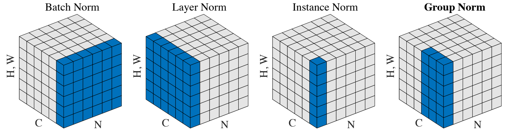

# 卷积（Convolution）
## 卷积（Conv）
>   常规使用场景为下采样，即对张量局部特征进行汇总计算。    

## 转置卷积（ConvTranspose）
>   常规使用场景为上采样，即对张量局部特征进行插值计算。    

## 拆分（Unfold）
>  从batched input tensor中提取滑动局部块，即对一个大的张量拆分成一叠小张量，并以列的方式进行输出。   

## 折叠（Fold）
>  Unfold是负责拆分的，Fold与之相反，是负责折叠的，即将一叠小张量合并为一个大张量。用户可以自己指定合并方式，小张量重叠的位置会相加。   

# 池化（Pooling）
## 最大值池化（MaxPool）
>  使用最大值进行池化  

## 最大值反向池化（MaxUnpool）
>  将最大值池化的结果逆向  

## 平均值池化（AvgPool）
>  使用平均值进行池化  

## 分数最大值池化（FractionalMaxPool）
>  用户可以指定一个分数，该算子在执行最大值池化的同时，使得输出的尺寸 = 输入尺寸 * 分数  

## 幂平均池化（FractionalMaxPool）
>  和平均池化类似，区别在于加和之前先对每个元素取p次方，再求和，最后再开p次根号  

## 自适应最大值池化（AdaptiveMaxPool）
>  对由多个输入平面组成的输入信号上应用二维自适应最大池化。用户只需要指定一个输出尺寸，该算子会自动采用池化策略。  

## 自适应平均值池化（AdaptiveAvgPool）
>  对由多个输入平面组成的输入信号上应用二维自适应平均池化。用户只需要指定一个输出尺寸，该算子会自动采用池化策略。  

# 填充（Padding）
## 镜像填充（ReflectionPad）
>  使用输入边界的镜像来填充输入张量。

## 重复填充（ReplicationPad）
>  使用距离卷积核最近的元素填充输入张量。

## 零填充（ZeroPad）
>  使用0填充输入张量。

## 常量填充（ConstantPad）
>  使用常量填充输入张量。

# 激活函数（Activations）
## element-wise汇总
>  

## vector-wise汇总
> 

# 规范化（Normalization）
Norm对比:

## 批量归一化（BatchNorm）
>   NCHW 在NHW维度上求均值和方差

## 层归一化（LayerNorm）
>   NCHW 在CHW维度上求均值和方差

## 实例归一化（InstanceNorm）
>   NCHW 在HW维度上求均值和方差

## 组归一化（GroupNorm）
>   层归一化和实例归一化的折中，即，将输入的通道分组，在组内执行层归一化，而实例归一化是在分组数=通道数时候的特例。