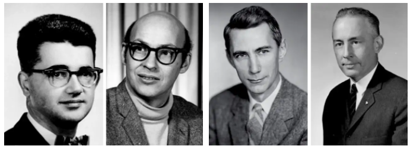
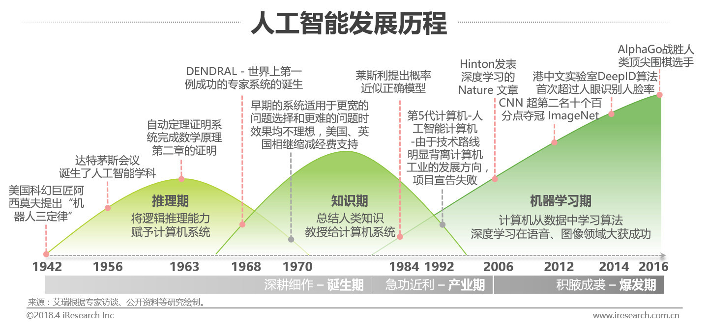
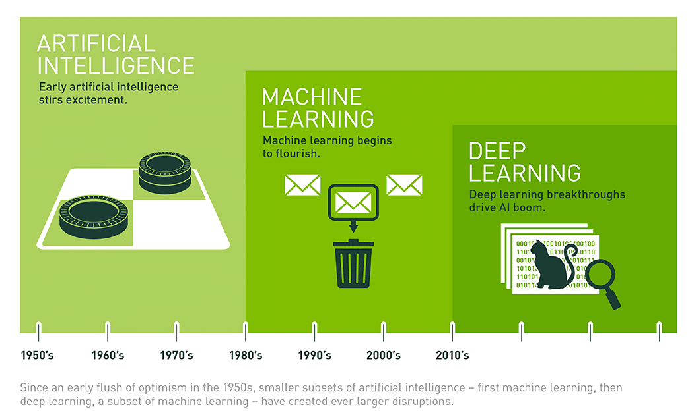
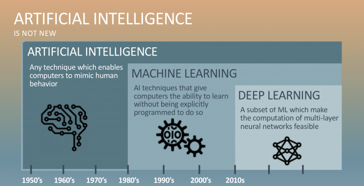

# 人工智能简介

${\color{blue} \mathbb{详情} }$

## 人工智能的定义
人工智能(Artificial Intelligence,AI)是以机器为载体所展示出来的人类智能，因此人工智能也被称为机器智能(Machine Intelligence)。人类一直在不懈努力，让机器模拟人类在视觉、听觉、语言和行为等方面的某些功能以提升生产能力、帮助人类完成更为复杂或有危险的工作，更多造福人类社会。——《人工智能导论：模型与算法》

## 人工智能的诞生
达特茅斯人工智能夏季研究项目(Dartmouth Summer Research Project on Artificial Intelligence)是一个夏季研讨会，被广泛认为是人工智能作为一个研究领域的创始时刻。

1956年，会议在新罕布什尔州的汉诺威举行了8周，会议聚集了计算机和认知科学领域最聪明的20名学者，专门讨论1955年8月31日的一个提案——[《A Proposal for the Dartmouth Summer Research Project on Artificial Intelligence》](https://ojs.aaai.org/index.php/aimagazine/article/view/1904)

</a>

该提案的四位作者为：
- John McCarthy (时任Dartmouth数学系助理教授，1971年度图灵奖获得者)
- Marvin Lee Minsky (时任哈佛大学数学系和神经学系Junior Fellow，1969年度图灵奖获得者)
- Claude Shannon (Bell Lab, 信息理论之父)
- Nathaniel Rochester(IBM, 第一代通用计算机701主设计师)

</a>

提案里列举了7个问题：
1. Automatic Computers
   > 自动计算器。如果一台机器能做一项工作，那么就可以编写自动计算器来模拟这台机器。
2. How Can a Computer be Programmed to Use a Language
   >如何编程让计算机使用一种语言。
3. Neuron Nets
   >如何让一组神经元排列可以形成一些概念。
4. Theory of the Size of a Calculation
   >关于计算规模的理论。
5. Self-improvement
   >一台真正智能的机器能够进行自我完善。
6. Abstractions
   >归纳与演绎的能力
7. Randomness and Creativity
   >随机性和创造性

## 人工智能的发展历程

</a>

## 从智能角度对人工智能的分类：

## 实现人工智能的主流方法：

能力增强是最终目标，多种学习方法的综合利用值得关注。比如AlphaGo中就结合使用了其中4种方法。

## 人工智能、机器学习和深度学习的关系

    

    

    

**人工智能**：所有让计算机去模仿人类行为的技术，让机器具备人类的智慧。(Human Intelligence Exhibited by Machines)  
>回到1956年夏天的会议上，那些人工智能先驱的梦想是建造复杂的机器，由新兴的计算机实现，拥有与人类智能相同的特征。这就是我们所认为的“通用人工智能”(General AI)的概念——拥有我们所有感官(甚至更多)、所有理性，并像我们一样思考的神奇机器。  
你已经在电影中无数次看到这些机器，比如终结者。通用人工智能机器一直出现在电影和科幻小说中是有原因的，因为我们做不到，至少现在不行。   
我们所能做的就是“狭义人工智能”(Narrow AI)。这些技术能够像人类一样完成特定的任务，甚至比人类做得更好，比如下围棋(AlphaGo)。  
PS：[北京通用人工智能研究院](https://baike.baidu.com/item/%E5%8C%97%E4%BA%AC%E9%80%9A%E7%94%A8%E4%BA%BA%E5%B7%A5%E6%99%BA%E8%83%BD%E7%A0%94%E7%A9%B6%E9%99%A2/55726794?fr=aladdin)(2020年成立)在研究具有自主的感知、认知、决策、学习、执行和社会协作能力，符合人类情感、伦理与道德观念的通用智能体。

       

**机器学习**：机器学习是实现人工智能的一种方法。(An Approach to Achieve Artificial Intelligence)  
>它不需要人类显示地(explicitly)编程去告诉计算机如何去做，而是使用大量的数据和算法进行训练，使其能够学习如何执行任务。

    

**深度学习**：深度学习是实现机器学习的一门技术。(A Technique for Implementing Machine Learning)  
> 从最早简单的[感知机](https://en.wikipedia.org/wiki/Perceptron)(perceptron,1958)，到[多层感知机](https://en.wikipedia.org/wiki/Multilayer_perceptron)(Multilayer Perceptron,1961)，再到[LeNet](https://en.wikipedia.org/wiki/LeNet)(1998)，最后到[AlexNet](https://en.wikipedia.org/wiki/AlexNet)(2012)，研究者发现，随着网络层数的增加，模型的效果可以得到十分显著的提升（AlexNet在ImageNet竞赛中将错误率降到了15.3%，远低于第二名的26.2%）。  
从此，这种网络层数非常深的模型得到了越来越多研究者的青睐，时至今日(2022.12)AlexNet的引用量已经达到了12w。  
之所以叫**深度**(deep)，主要由于研究者在设计网络模型的过程中，使用了很多的神经网络层(Neural network layer)以取得更佳的效果，我们把这种使用了很多网络层堆叠来构建、训练网络的机器学习技术称为**深度学习**。  

# 关于本仓库

${\color{blue} \mathbb{详情} }$

## 知识的组织方式
在该小结中，我们介绍本仓库对知识的组织方式。我们尽可能选择一条多数人走过的学习之路，同时会对这期间遇到的知识进行**系统地组织和提炼**，以帮助读者高效、清晰地学习。  

本仓库有两种组织方式，分别为**技术专题**和**业务专题**，如下（未来还会补充更多子专题）：

 

 

采用这种组织方式的理由是——**对学习和工作都实用**。解释如下：  
> 一般来说，公司在设置招聘岗位时有两种方式：
> 1. 按**技术**描述岗位。比如：算法工程师、人工智能工程师、机器学习工程师、深度学习工程师、强化学习工程师、运筹优化工程师等。
> 2. 按**业务**描述岗位。比如：图像算法工程师、自然语言处理工程师、语音处理工程师、广告算法工程师、推荐算法工程师、风控算法工程师、数据挖掘工程师、OCR算法工程师等。 
>  
> 虽然有以上两种方式，但是我们要清楚**技术是为业务服务的，某一项技术可能服务于多种业务**，比如**强化学习**这门技术，可以单独拎出来讲一个技术专题，也可以结合具体业务（比如推荐和风控）讲一下具体的应用。所以，我们将知识的组织方式也分为两条线:
> 1. **技术专题**：这条线上我们更加专注于系统性地讲解某一项技术，比如强化学习，我们就会讲解里面的一些发展历程、基础算法、优化方法、应用场景等。简言之，就是**重某一项技术系统的理论体系，轻具体的业务实践**。  
> 2. **业务专题**：这条线上我们更加专注于如何提升业务指标(比如推荐算法中的点击率)，那么就会涉及到很多种技术(比如强化学习)如何合理地在该业务上进行实践的问题。简言之，就是**重具体的业务实践，轻某一项技术系统的理论体系**。   

## 使用建议
本仓库是一个AI学习手册，知识点繁多，覆盖领域广泛。因此，我们**针对不同的读者，给出一些使用建议**。

如果你是**AI初学者**。
> 可以优先学习技术主题中**机器学习**和**深度学习**的内容，建立对机器学习方法论的基础认识。然后根据自己的兴趣爱好选择一个主攻的业务领域（比如计算机视觉）进行专项学习。

如果你是**AI工程师**。
> 可以通过该仓库丰富自己的知识结构，也可以直接引用其中的代码提升开发效率。  

最后，本仓库会尽量使用通俗易懂的方式进行知识讲解，不过分拘泥于数学公式。

## 参考资料
国内比较流行的AI资料有：  
* 李航老师的[《统计学习方法》](https://item.jd.com/12522197.html)
* 周志华老师的[《机器学习》](https://item.jd.com/12762673.html)
* Andrew Ng的[《机器学习》课程](https://www.coursera.org/learn/machine-learning)和[《深度学习》课程](https://www.coursera.org/specializations/deep-learning#courses)
* 吴飞老师的[《人工智能：模型与算法》课程](https://www.icourse163.org/course/0809ZJU022-1003377027)，以及配套书籍[《人工智能导论：模型与算法》](https://item.jd.com/12653461.html)
* 黄海广老师的[《机器学习》课程](https://www.icourse163.org/course/WZU-1464096179)，该老师的[GitHub](https://github.com/fengdu78/WZU-machine-learning-course)中也囊括了很多优秀的代码示例。
* 还有一些知名的开源库，比如：[sklearn](https://scikit-learn.org/)、[pytorch](https://pytorch.org/)和[yolov5](https://github.com/ultralytics/yolov5)等。

接下来，我们就按照前文所说的知识组织方式一起走进AI的知识海洋吧！

# 技术专题
<!-- 

${\color{blue} \mathbb{详情} }$
 -->

## 机器学习

## 深度学习

<!-- <a href ="https://raw.githubusercontent.com/itmorn/AI.handbook/master/imgs/DL.svg"> -->
</a>

## 强化学习
todo...
## 图表示学习
todo...

# 业务主题

<!-- 

${\color{blue} \mathbb{详情} }$
 -->

## 计算机视觉

## 自然语言处理
todo...

## 语音处理
todo...

## 推荐系统
todo...

<!-- # 更新日志
2023年1月5日 完成前言部分

${\color{blue} \mathbb{详情} }$

2022年12月30日 新建仓库

 -->

# 讨论交流
由于本人水平所限，内容中一定存在不足甚至错误之处，欢迎读者不吝指正。

