# 人工智能简介

${\color{blue} \mathbb{详情} }$

## 人工智能的定义
人工智能(Artificial Intelligence,AI)是以机器为载体所展示出来的人类智能，因此人工智能也被称为机器智能(Machine Intelligence)。人类一直在不懈努力，让机器模拟人类在视觉、听觉、语言和行为等方面的某些功能以提升生产能力、帮助人类完成更为复杂或有危险的工作，更多造福人类社会。——《人工智能导论：模型与算法》

## 人工智能的诞生
达特茅斯人工智能夏季研究项目(Dartmouth Summer Research Project on Artificial Intelligence)是一个夏季研讨会，被广泛认为是人工智能作为一个研究领域的创始时刻。

1956年，会议在新罕布什尔州的汉诺威举行了8周，会议聚集了计算机和认知科学领域最聪明的20名学者，专门讨论1955年8月31日的一个提案——[《A Proposal for the Dartmouth Summer Research Project on Artificial Intelligence》](https://ojs.aaai.org/index.php/aimagazine/article/view/1904)

</a>

该提案的四位作者为：
- John McCarthy (时任Dartmouth数学系助理教授，1971年度图灵奖获得者)
- Marvin Lee Minsky (时任哈佛大学数学系和神经学系Junior Fellow，1969年度图灵奖获得者)
- Claude Shannon (Bell Lab, 信息理论之父)
- Nathaniel Rochester(IBM, 第一代通用计算机701主设计师)

</a>

提案里列举了7个问题：
1. Automatic Computers
   > 自动计算器。如果一台机器能做一项工作，那么就可以编写自动计算器来模拟这台机器。
2. How Can a Computer be Programmed to Use a Language
   >如何编程让计算机使用一种语言。
3. Neuron Nets
   >如何让一组神经元排列可以形成一些概念。
4. Theory of the Size of a Calculation
   >关于计算规模的理论。
5. Self-improvement
   >一台真正智能的机器能够进行自我完善。
6. Abstractions
   >归纳与演绎的能力
7. Randomness and Creativity
   >随机性和创造性

## 人工智能的发展历程

</a>

## 从智能角度对人工智能的分类

<a href ="https://viewer.diagrams.net/?tags=%7B%7D&highlight=0000ff&edit=_blank&layers=1&nav=1&title=Classification%20from%20the%20perspective%20of%20intelligence.drawio#R7Vtbc6M2FP41eswOSCDEIxiczLQ7TZvpZHZfOhhkm1kMLsZxsr%2B%2BumFucuJ1Ym%2FrkvE44uiKdM736RzJAE1Wz7dltF5%2BLhKaAWgkzwAFAEJsOOybC16kgFiWFCzKNJEioxE8pN%2BpFJq1dJsmdKNkUlQVRVal664wLvKcxlVHFpVlsesWmxdZ0hGsowUdCB7iKBtKH9OkWqq3gE4jv6PpYln3bGJX5syi%2BNuiLLa56i8vcipzVlHdjHrHzTJKil1LhEKAJmVRVDK1ep7QjM9qd8amB3L3Qy5pXh1T4dcvpe%2FHN1%2Bdx2D2%2BGUX%2Fn5%2Fu7yxsGzmKcq2ai4AxBlr0N%2Bso5wPu3pRs4T%2F3vKx%2BvMir242Yg09VsAka6YGfpPPUgvxP7SA7%2FFPaAPfAZ4NQgxcV0gIIAj4Qd0ZG7bsT1WVM7bvGrJXYbrAHvzdMq3owzqKec6OaSOTLatVxp5MloyydJGzdMxmhZZMkNNdmLDFrttyWiOl%2B4xm8Pyd9vl5lVYvf9AsqtIiDzWl4aR52FRRWXlcGw80J5VDW5fmyYk1N3Sx4hrQrsjNqlUk3pZPNOmW6LZRbMuY3tMyXVE2a3x203zRqdBtkb3pglZvVHACXrKkdMrMkWejwFCSz8WTFPAlm6dZNimyohRLjeYkpnEs5rMsvtFWzozYls2b2JuSodSxXl2zfpYIY5K9LrXtRJnOEy0r%2BtwSKbu5pQV7q%2FKFFVG5rqHMRMGbhZRN7xqwMA0lW7aAwlKySOHTYt90Y6gsoWz1B%2BzWRkO7DV3gQUAwNzd3yj8%2FYICzsjHbKfAngBBRPQRuwAu7JvB8UcsDHuvCAS7L9UUC8X5DBIgBiClq%2BSLLFoVNnvBEm3xgBm9KdeEO7PwN6xZIS5Pa1stYLbTQioHp8wVOGch7KmOVJgnvSGlWjfSiqW1VbJTSSOyLpYJax%2BnwiDI%2FFWV6EJJElMy1EIJjQmfzAWq8HyJMk4FNGyMgcT%2FZQ5TAWIMS9rlQwtKwe59ZW2p7SBM7WocCoSctbdpLai1hU2o0GqFMSr%2F6yp70Ky0zG6Mfwv2hhZO9HbHxkT0fgbR8nl5VhFJM21N3R6lbUlX1vki5Qe0VyLCdLslA61NPMdQcyoo93diP5B3qYg%2FUJaB0zSQ%2BF4xYPWL1dWA1su3atGq0xkOsJuYQqtHZNnQ6R%2ByqoPqUlT8d32vYfhvf7QvhO0Swp3TIMS6N8M5Ay7xsvYxuixHdR3S%2FFnTHRtfMEBpguwMvie1kxPafg%2B3OpbAd4k%2B20fzBrgLiM%2B7kX35bP1jLu9vwT4rzX%2F76fjdL8hs4VLjQ5fEZ11OhG48cFR1iEkKAi7mElyHniTIRHmiSCTZIHjiaAhLUErcfXCIhfwuemIrxeIBMVGEvEOGmQASpmITlGnVfIgDF5ITNBhSzMWkNnjVoirCVzAp0szGGrUayPCNZ2pQklg40CZwhjPVkOWBGDageJkvD7oatLOhowlYQa%2FjyI8JWWvTSxLaviy51pNSls9dQ%2FfRw1xmCVtDtqI9toosSnSbAqZiBqISLBH4z9rBH2B5h%2B0pgG%2BFesBgNQbtG9o%2F2cbSGOAwdXxlmn7LsB4C%2BjdavAf2bhGAdrTfvxnmT9IJXtnFZl0bjQ7MNOvM32EeeK3PIt7lz4obCFZmIvfs7nRPWoKW8Js8RPsnQK7D4N%2BcZh5ckln5grAw%2FJhcD437L6EuMpHQ%2BUprPKdbfokkcd2Yc2JO%2Bj5RMiLoQgTXXZM51AK4FDffaWelET4L8FzwJeFF%2Bqa%2BidghGoj9WQSYV%2FfLEVSbMo0eSVxgftMNpI6CPgH4dgI6snk1q7j261gW9DNMcGul1Afop636qm0GOZIsaGi%2FhZ6D%2BzQyMnAsfntTE02ECcULBDynkDVh5lGAD4rRIQrgI%2FHYr5vt64iuS8KYjW4xs8T9gC9iLELhIdwPWOtPRu96Wr%2F4s4V9JGIdOKs7iNrxy8o6R%2BWHkwR6bH2vJ4s1v4VD4Dw%3D%3D">

</a>

## 实现人工智能的主流方法

<a href ="https://viewer.diagrams.net/?tags=%7B%7D&highlight=0000ff&edit=_blank&layers=1&nav=1&title=methods%20to%20achieve%20AI.drawio#R7V3ZcuO2Ev0aPjpFEsT2SGqZqbp3biaZSk0lLylZhJaKLPrS8pavDwAu4gLJiscEVWTPw5gCwRXd5zS6G00HTe5ePqWL%2B82XJBY7x3fjFwdNHd%2F3XI%2FJP6rlNWthft6wTrdx1uQeG75t%2FxbFkXnr4zYWD3lb1nRIkt1he19vXCb7vVgeam2LNE2e691WyS6uNdwv1qJ2G6rh23KxE61u37fxYVM8BT22fxbb9aa4skd4tud2sfxrnSaP%2B%2Fx6%2B2Qvsj13i%2BI0%2BSUfNos4ea40oZmDJmmSHLKtu5eJ2KnXWn9j8xN7y1tOxf5wyQH%2F%2FT2NouXNH%2FT79Pb778%2BzX75%2B2twEJDvN02L3mL8Lxyc7ecLo4X6xV7d9eM3fEvn%2Fo7rXaJXsDzcPegxD2cFj91IOouN%2BubXWf2eBEzEnkhvEibDDPLXB5TbXLcjhuLiYvO3sevmh2RsrL%2B3LR5GyIH9Ez5vtQXy7XyzVnmcpjrJtc7jbyV%2Be3Fzstuu93F7KtyJS2bAXz7NYDnZxLlq5U1HuON68eqZy%2F%2F6wPbz%2BKnaLwzbZzwy9%2Fcnxx8NhkR5CJY0nTpcJh%2FFYsY%2FfeeSDWN8pCageqNSq0mX5mD6JuN6jfo7kMV2KryLd3gn51tTb3e7XtQPqZ5RPuhaHNw6gU9UzFWIu1VHtRlM3b%2FmSPGUNashW291ukuySVA81WrGlWC71%2B0yTv0Rlzy3DAVanKFXJzcWxGF2v%2BJ0hjISlQpaqepKrzpNID%2BKl0pTrzSeRyKdKX2WXfC%2F3cjXJ4Q0TnP1%2BPoKF5%2BZ6vqkARZC3LXJ8WpenPiqq3Mh19V%2FoLUZtvZ1RJ5w4IXFmUtfmTkQrChgopWO8aAmVAsohktuyczR3GFKH89BhgTOTPV19lOw5c7hWWzZzQqb7uA4jLf18Qys1Qoq40NF0mQ%2BQHs2WyqqB2UpwDvMdd9s4VhfKJaJAaH2qx0PykA92hlnLTLCCy2QP0KFXdGiofrwQbGVUfbJk4nbV0vYfV21CaU21A%2By1VZuQtmqjzlQ7MFBykw4rMntKDGsih6ZaSCqiVLYUIiLfp3sUh1yfzEOfK5N5mLOdR41vY%2FSpUcuudoG1kl35AnhU7%2BmsFKT6tT3VzUDTkOaHfk22Spvc0vLFDfHxg59w%2FSz5O8wObMhGeSc%2FIC7YwARYoXY0VVAe%2Bg5nBkwHBAcEHwSCB4wUKpcrIeKkheHUYJ11B%2BGmWdWgIPw9A%2F9%2B3C%2Fg%2FG3cx5Zw30d%2BU%2Bioaxv5qQH5Jby7DkdqI5Rm%2FRSQH5B%2FwMhfN75Q37jPAPf7wX1qC%2Fd9aWy4x39%2BnQNIh9b%2F68%2F334LN50%2Bz3wTZ%2F%2BfPvz%2Ffxvsb30AB3OHUCWcV4584kecwzQ6h3IUucwNlTh89m5BUkrlxuSSXieoTBWoXUAlQSQdUggWLAxOmMP8WEdIBlTTdQJjTFpV05gYyarbBwTssKvlQL9A5cOzeCeTzuvB4yCoJGByGygPkKtjOYgHKhy8BfqK2AcUBxQeK4gGr22O4MMifq0F9iyBu8M0OC8TfM%2BoXIf85QH8T%2BANrwO%2FWJ6AYW7b%2FDRNOhe9YeYGUAT8tJgJcTQEUGYQ6jnuZ%2FS9JQvWRXML1UXIiMNUBZh1ODt2WMANzAHP8OHOsVoKYM0Biym%2Fdy03J99v%2FlKCe7X8%2BdOro3v5nvdn%2FvlUSKLIoG8lAPNJ2v9yYap8PoDeg9zDRu2n3E1baYRZCAWad9No6OSz8fs%2FAv9%2F0ZxdifoGFXYM%2B5qgRAGauXa9PQTJN258qaAf4B%2FgfD%2FzTehyY%2BsgA%2F1YdP97g3fdXCv%2BWfP6Y0TNxYFpEjz6eCmbRL9P5z7%2Fy9f%2F85%2FnLH2L%2B21d0Y7A1VKjXc9ik4up532IAHTbIvEDybJwAkQCRWCES4cVYUBOecELRoov4gec2M4qoZ2CSzhxBRuU2mXnY4fNCp0OVpqE2Ir3kB%2Bt0v0ndj9tYcwf6Cvo6CH1FDcsPMd7WVtemto7P7rtg3C%2By%2B85ZNlW77xxIdu%2FqRUFj2h%2BwDmN%2Bxmc9ke7RIASqrDRlrlEF%2BSEGQgBCGB8hBMd1Gr1RwviSQK6CEuwlgbAzroCAcsv0MPi1Zx8aOD4nYt2LjtuoK1H4KC2JimkBGVZJQzws8kVZkf6vzQUWqvjChX4jps2LoyFCVBqROoqpntEUzA4wOz7E7HjLL71aMWYiI0QQR%2FE5MvoB1xH127mndh1H5txANtGuX50fzrJMwKnOBpcKi3OFlf8rPzFWHZieQkSeagGFBYUdjMIiH9UUlnjt1aN2JwqDT%2Fn70KF%2Bc6JAL7T2bKUJEtr0HUkDMLBq8BkzBSucYDDZJPaTfE1pFAAnACeMihO42zMnjDKP8ApIwVYeoZwSnHMfcc7sEoQh2jwscevee2SrFkXTe0RdbldWzDVI%2BVxHm7L6QzpdiEeq8lBWmiiCaqJgQwy3IhENaioZUNNCBB7YNCAGX060%2F5pEZ%2BGx%2B5pErC50CNuNIngnKpBGeiGCnELOtH8RUB9Qf6Co36pAij17y8%2FMOjn4KPC1or61CqRN1GedLT8zP6g5eNwMFUOxIUD9oRYbYnXMN5SMs4v5I6w%2Barna0Fkk7B7yaXPNcdD8wEzXoG8IUc6Yw32V2iMhnnGN%2FjqHKNSeHgn6PMoThbIvyQAfAB8Mkg8KsC9iR8hQQtRq7Mg3RHuBECwQAu%2BPEKjdhIJSTVoppNL%2BhyIUAP%2FjLUJhqCDXVQkKs2oOPpTbewmKs5DYNfqzoJ4qQLnthYi%2BKQBcVpkoa40C5gPmDxTzG3XnyhJgfbmA%2FPEFe68D8y3FepuYzxCzjfnmYC%2FUCALMHynmFyrZG%2BaPL9R7HZhvKdLbwnzqW8Z8ZLLz2xVHiLL2Q%2F2VAT5zWAQVR4AO7NLBVVQcMZeMs1uEanzTgKsoOYLspXyiptDZZQTTLKBdghCryDCbnChGFenKEVQdxVFlRTqwBrDG4FkD14067BnrVGGbKwXQ%2BCYS18Ea9lJGUVPo7LKGKWW0zRpIbTDPxBoloRjnGkAoQCijJRRUTwfH2PQNBI%2Fb9Eyh8SWkXgehWEtIbRIKtrsGAZnSUY2Vreol7QD2AfY%2FAvavomZJwLy6EvJ24TmrAYlgfGmnnZYsuTQggWylnVZsizLX2XZMIjAlnnKVZirnA8ABwAHj4gDa1EebX0AzK6gPLNAHCxTAOA4WMH0LI2OBbBFy5kgC8AfwHzD4NyYAhJpiCXanAOP75kWn4F9UI3wb%2FW199QLzZs0T6llHf0PA6rjsANAf0H%2BE6E%2Fdvt0%2FhigfYL8N7Ccjwn5sykktK5kH6nM0WQEKqR7hvMhSJbouKdVLkaliCaYXqsldIYHa5kAUQyYK5DWIghjiw8gmU%2BDxpaleRW1zbCtNFXn1pATKPNs0YV6uFs50FpH%2B5FHITHwBkwbgguFyQUB4XTED2nedajy%2B7NNOyeDiiqXYVvqpYdrAqG0%2BOJGCyhTcAzEAMYyeGFBDQ9sVLSx%2FPXt8SaRXwgu2skibH92izL2QFdrnapdip7whmfk4dcYwppzU6if25g4rOUd%2FFUeFKXB9lUKgP7qnlzSwEBxTwDlD5hxULEM6U1HDrmOKQAZrP44pWxmsTceU%2FZoa5ET%2BaqSRv1znBrMNQP7hIn%2BrlpIf9J25RHyA%2Fg%2BdbvALsb8ARAtuKNqYIjAS2EZ%2FU%2FS6XL0ANAA0MCoaaJRQYoX93dfaBQKB6Z5IwFZkulsSkD%2FTRKnasbuE5M2XJBaqxz8%3D">

</a>

能力增强是最终目标，多种学习方法的综合利用值得关注。比如AlphaGo中就结合使用了其中4种方法。

## 人工智能、机器学习和深度学习的关系

    

    

    

**人工智能**：所有让计算机去模仿人类行为的技术，让机器具备人类的智慧。(Human Intelligence Exhibited by Machines)  
>回到1956年夏天的会议上，那些人工智能先驱的梦想是建造复杂的机器，由新兴的计算机实现，拥有与人类智能相同的特征。这就是我们所认为的“通用人工智能”(General AI)的概念——拥有我们所有感官(甚至更多)、所有理性，并像我们一样思考的神奇机器。  
你已经在电影中无数次看到这些机器，比如终结者。通用人工智能机器一直出现在电影和科幻小说中是有原因的，因为我们做不到，至少现在不行。   
我们所能做的就是“狭义人工智能”(Narrow AI)。这些技术能够像人类一样完成特定的任务，甚至比人类做得更好，比如下围棋(AlphaGo)。  
PS：[北京通用人工智能研究院](https://baike.baidu.com/item/%E5%8C%97%E4%BA%AC%E9%80%9A%E7%94%A8%E4%BA%BA%E5%B7%A5%E6%99%BA%E8%83%BD%E7%A0%94%E7%A9%B6%E9%99%A2/55726794?fr=aladdin)(2020年成立)在研究具有自主的感知、认知、决策、学习、执行和社会协作能力，符合人类情感、伦理与道德观念的通用智能体。

       

**机器学习**：机器学习是实现人工智能的一种方法。(An Approach to Achieve Artificial Intelligence)  
>它不需要人类显示地(explicitly)编程去告诉计算机如何去做，而是使用大量的数据和算法进行训练，使其能够学习如何执行任务。

    

**深度学习**：深度学习是实现机器学习的一门技术。(A Technique for Implementing Machine Learning)  
> 从最早简单的[感知机](https://en.wikipedia.org/wiki/Perceptron)(perceptron,1958)，到[多层感知机](https://en.wikipedia.org/wiki/Multilayer_perceptron)(Multilayer Perceptron,1961)，再到[LeNet](https://en.wikipedia.org/wiki/LeNet)(1998)，最后到[AlexNet](https://en.wikipedia.org/wiki/AlexNet)(2012)，研究者发现，随着网络层数的增加，模型的效果可以得到十分显著的提升（AlexNet在ImageNet竞赛中将错误率降到了15.3%，远低于第二名的26.2%）。  
从此，这种网络层数非常深的模型得到了越来越多研究者的青睐，时至今日(2022.12)AlexNet的引用量已经达到了12w。  
之所以叫**深度**(deep)，主要由于研究者在设计网络模型的过程中，使用了很多的神经网络层(Neural network layer)以取得更佳的效果，我们把这种使用了很多网络层堆叠来构建、训练网络的机器学习技术称为**深度学习**。  

# 关于本仓库

${\color{blue} \mathbb{详情} }$

## 知识的组织方式
在该小结中，我们介绍本仓库对知识的组织方式。我们尽可能选择一条多数人走过的学习之路，同时会对这期间遇到的知识进行**系统地组织和提炼**，以帮助读者高效、清晰地学习。  

本仓库有两种组织方式，分别为**技术专题**和**业务专题**，如下（未来还会补充更多子专题）：

<a href ="https://viewer.diagrams.net/?tags=%7B%7D&highlight=0000ff&edit=_blank&layers=1&nav=1&title=Technical_topics.drawio.svg#R3Vldb6M4FP01fizC3%2FZjSGh3pR2pu12pmnkj4CTsEMgQ0rTz6%2FcaTAKETledJu1sVLXm2L6277nnXociOl0%2F3pTRZvWpSEyGiJ88IjpDhCis4bcFnhqAEdYAyzJNGsg%2FAnfpd9OAuEV3aWK2DmugqiiyKt30wbjIcxNXPSwqy2LfH7YosqQHbKKlOQHu4ig7Re%2FTpFq5YxF5xH8z6XLVroyFO%2FA8ir8uy2KXu%2FXyIjdNzzpqzbgzbldRUuw7EA0RnZZFUTWt9ePUZNarfY9dP9N72HJp8uq%2FTPjjcxkE8dUXeT%2Bb33%2Feh3%2Fe3qyunJWHKNs5VyAiMrAXbDdRbnddPTkniW87u9VgUeTV1bamcAIDsNpAFATHfmgt67%2BhQGqClG8beoom1yhkKFBIUxRqNCFIq3Yx2HWznpvaOOywNIGTQCjAQ7BfpZW520Sx7dlDMAK2qtYZPGFoRlm6zKEdg1NMCUBu9mECXLe2ZGen5tBx3Lw906E%2Fr9Lq6S%2BTRVVa5OHIaDI9PmyrqKwmNhifMdfExuhckyevnLk1y7UNgO5Eq6rOkHhXPpikP6Jvo9iVsbk1Zbo24DXr3TRf9ib0LcJJl6Z6YYKc2ZGlMdegRttNZ75DPhUPDWApW6RZNi2yoqyppgsVmziu%2FVkWX02nZ64449bEQUm%2BC8eWXdw%2BNwkGq0MsdWXSxrwpK%2FPYgZxsbkwBpyqfYIjrJUo0U1x2I9JJen%2FMFdpBq06aaLHIZaflwfJRptBwSh1X7Vxt%2F07%2BuXuq%2BO%2BT7%2BZ2%2Fi1ZFWOqbTQWTFDIkQZ1KduYzNBE1KoDxP8JVW03TdZdpI8QSSecJZFRi1HORKzMfHFC0zgBIzQ9ywmWuMcJ1uyEE65POWmxN%2BeEjnISSBRgSwUwY6m4ICfcqISNcaLInApxDk5AcF1OKNPvywkbqW5Df7eZl87qLNvzcV3YrXPrTNPMtUXjx%2F4B%2B3VCfVnATR59qTyf%2Brvrz5G802JlXbke%2Btsdc7Jb4bZIbSVp6aSY99MeoX0Trm40s7o3j6Eh0TeE5cCQqydDQzXnh2O%2FPgz4Rw0D%2BiuEAaHEE5hLwTEInPh8UAw59XwokYpQ6PIlZq8LEqKpxzAhgmLiC8YHqcSXns8hJCmDtRgWFw0gMZLbIaW39VZNkb5obl8sjBi%2FIyVSz%2F3Ta9HP5%2FbDN7qWdvzO9VZeQtQvKlg8K%2F6PLWpK%2BSVETaX2mORYCioo10T3g4gy4XFBpS%2B1IMynly0LalTVOkBBiEKF4EuSvUVLNGFO55eSt8FweZNj8tZC0ugcVzdGhae7nwFR7c3uvdSuP4Ta1S%2Bqdia0J3hH7fQsamfKBpFSoGUuJIYV%2B8to7WkGRVwo2ITyh8ucWe7tu8ZhFQ%2BR4q3eeV3O7Y%2FnnVHf9WdM35AlNU1G3mq8gcQp838ocf3OEsdj7yIvr%2FE2TP5vIocU%2FjYlXWBP%2BL6slxJcDlbR0tPKB5lzyRmmg2B5tcTh8fimvBl%2B%2FEcEDf8F">

</a>

<a href ="https://viewer.diagrams.net/?tags=%7B%7D&highlight=0000ff&edit=_blank&layers=1&nav=1&title=Business_topics.drawio.svg#R7Ztdc9o4FIZ%2FjS%2FD6Pvj0gbS7ux2pt3ObKa92XFsAZ4CpsaEZH%2F9SrYEtlESSgK0KZkOtY8sWZbO8x5JlgPcn92%2FK%2BLF5EOeqmmAQHof4EGAEGRI%2FxrDQ22g0BrGRZbWJrA1fM7%2BUzajs66yVC2trTaVeT4ts0XbmOTzuUrKli0uinzdvmyUT9OWYRGP1Y7hcxJPd603WVpOaqtAfGt%2Fr7LxxN0ZMlmn3MbJt3GRr%2Bb2fvN8ruqUWeyKsc%2B4nMRpvm6Y8DDA%2FSLPy%2Fpodt9XU9Oq7Ra7fiR1U%2BVCzct9Mvz1pYii5Oorvxnc3nxZDz99fDe5Iqwu5i6ermxbBIhNdYHRchHPTbXLB9tK7PvK1DUa5fPyaln1YagvgGKh3SDapuujcfX%2FkASRCGQYDGkgwiCE1hLpJBmEKJDC3UxXu76fzVq32ObWSD%2BK9gV9Eq0nWak%2BL%2BLEpKy1N2rbpJxN9RnUh%2FE0G8%2F1caJbRRXaMFfrYao725XFGzVVm4Rt5c0zbdLnZVY%2B%2FK2mcZnl86HnatTfnizLuChD442PFFc7hzevmqcH5lyq8cx4QDOjwapxSbIq7lTavqJdRr4qEvVRFdlM6VYzrZvNx60M7RL1k45V%2BUwGPjBXFkpdaxxNMh4Aa%2FmQ39UG02WjbDrt59O8qLoaj0SikqRqzyL%2Fphopt4ISaorYoASsO7rehe68VhgoNr7U5MSic6eKUt03TJabdyrXT1U86EtcKgKWE6tvmND6fL1VC2k5nzSEwtliq0%2FjTdFbUPWBZfVHuJW73GrKZBREwwo3HIjr6kAEggVDHkTQcNfl6hmaKmVTqWOrSGzDVr2wg5pp0EyLamgTZlmamhvZnnTKWhW1KvOl7aRaa5LaIch%2BPnOh%2BqxUd5BNYyVGXmRZItTtaIfSlyMpGWkRidx5g0juIRIfi0gKPJG0G8UaLvuYF7Y8Dg8qH2l40sbiPEQ3J9h6g8XJ3%2FOWJX8v14lb4L3S%2BsPd%2FmhP11WsTX%2F27%2Frvh%2BLTDfkXhLN%2Frv9YfV9cYTsMrGq7hxKatn3ScYqqqe%2FaIz6fG9isH%2FPMALiJAZsxn4sBQvZouxTb7nXGjj9tavICF4O7LqaVXYt%2BqEWfBZpOwasDrf7AHEQ6AFxE%2FyL6b1T0McJnFn10Ef1ziL5TwhOIPu6Bxh%2FqhAB86hBAPSFABOF1EA7MpFpeBxGuZgLADP11CNC%2FbhZyCQGXEPC6IYAqkRKfFgh0ixk7QgiAhDDH3E8z9Pctor3xKPB8zx8eBcS%2BUYCeKAroh2rrPmSnVX2%2Bl%2BpXFrPaUy37hJeB%2F0X1367qn3%2FsLy6qfxbV57%2BJ6jOf6rNAMrvKI%2FtB2L%2Bs8V9U%2FySqr6Cmn%2FvYl4zj%2BBiq313uIa6Ic0k%2B%2B%2F0kf49uP1zy2Z6Sz04l%2BYCjzjCDcHla0fe92NUjfF6t8XMz4JekWuMX1YYKGsjhZY3%2FIvpvV%2FQFOK%2Fo89%2Fvxe7PIfqnerF7UtF%2F6rVHd3lnWCl8pfzSjfijsEri1Yi%2FPpC77rj3brnlot5OOcrujXO8zju%2BHdg9jvL4VB%2FIzvIu353ou%2F2mTQFwtpcIgLd3yB7871DsjbVgA07HqZ8l6cnNm02UHvev3RZvNCj1KKqzvZQv5LbRunk0FnvR5SmJt0tColOSlcBjcepZ59cM6tl4GBpOBQki1liYFWaQZsIXMOO0kJgLzH4NYOA9GrOHxezXZZaQ3ZnaSZn1LJ28PrPPcsdeyvb5mAW8B5AEBBGKOHTN9%2BC6TfSI4BwDhgGXmL8Sz5R0%2FOHIPHum896X6adC97CV9Zehqzvw5wq3ngnwGdAVvyy6GLIn0EWSt9Hdb%2F%2BKb3W8vSUewU5Vj8wu9EzLzHaXoQm6JioPDK1mURxXH5xw86uJPhq8o9EI%2Bb9bSNkto8eB1%2B1%2BdUMrKc4Lr%2Fvu6xceLEPgb%2FNTRV5BerobGeSSQspR562nwD1BICWMcO1TtFP%2B%2FvQi3pPmMz2BOCXY1XPzeQvpcQAJZZhwKLrx%2Fdhk%2B%2Fa4UfNhi6BVfIZBSKv3XuZfr3c8pFX150MaMyxx6llJeQ2qEe2MpunuaJpKjwvKx73tZVTvs8Hp2FQ%2F6SvPfyZw5qDMWY9RqpmFEAoEOh0MYI%2Ba2SzCgDLAITkQa0RRj0sB9fwLcsLaVBMCelJyTTcWgukbdUL%2FwVjr0%2B1nrPXl26%2BE8fB%2F">
</a>

采用这种组织方式的理由是——**对学习和工作都实用**。解释如下：  
> 一般来说，公司在设置招聘岗位时有两种方式：
> 1. 按**技术**描述岗位。比如：算法工程师、人工智能工程师、机器学习工程师、深度学习工程师、强化学习工程师、运筹优化工程师等。
> 2. 按**业务**描述岗位。比如：图像算法工程师、自然语言处理工程师、语音处理工程师、广告算法工程师、推荐算法工程师、风控算法工程师、数据挖掘工程师等。 
>  
> 虽然有以上两种方式，但是我们要清楚**技术是为业务服务的，某一项技术可能服务于多种业务**，比如**强化学习**这门技术，可以单独拎出来讲一个技术专题，也可以结合具体业务（比如推荐和风控）讲一下具体的应用。所以，我们将知识的组织方式也分为两条线:
> 1. **技术专题**：这条线上我们更加专注于系统性地讲解某一项技术，比如强化学习，我们就会讲解里面的一些发展历程、基础算法、优化方法、应用场景等。简言之，就是**重某一项技术系统的理论体系，轻具体的业务实践**。  
> 2. **业务专题**：这条线上我们更加专注于如何提升业务指标(比如推荐算法中的点击率)，那么就会涉及到很多种技术(比如强化学习)如何合理地在该业务上进行实践的问题。简言之，就是**重具体的业务实践，轻某一项技术系统的理论体系**。   

## 使用建议
本仓库是一个AI学习手册，知识点繁多，覆盖领域广泛。因此，我们**针对不同的读者，给出一些使用建议**。

如果你是**AI初学者**。
> 可以优先学习技术主题中**机器学习**和**深度学习**的内容，建立对机器学习方法论的基础认识。然后根据自己的兴趣爱好选择一个主攻的业务领域（比如计算机视觉）进行专项学习。

如果你是**AI工程师**。
> 可以通过该仓库丰富自己的知识结构，也可以直接引用其中的代码提升开发效率。  

最后，本仓库会尽量使用通俗易懂的方式进行知识讲解，不过分拘泥于数学公式。

## 参考资料
国内比较流行的AI资料有：  
* 李航老师的[《统计学习方法》](https://item.jd.com/12522197.html)
* 周志华老师的[《机器学习》](https://item.jd.com/12762673.html)
* Andrew Ng的[《机器学习》课程](https://www.coursera.org/learn/machine-learning)和[《深度学习》课程](https://www.coursera.org/specializations/deep-learning#courses)
* 吴飞老师的[《人工智能：模型与算法》课程](https://www.icourse163.org/course/0809ZJU022-1003377027)，以及配套书籍[《人工智能导论：模型与算法》](https://item.jd.com/12653461.html)
* 黄海广老师的[《机器学习》课程](https://www.icourse163.org/course/WZU-1464096179)，该老师的[GitHub](https://github.com/fengdu78/WZU-machine-learning-course)中也囊括了很多优秀的代码示例。
* 还有一些知名的开源库，比如：[sklearn](https://scikit-learn.org/)、[pytorch](https://pytorch.org/)和[yolov5](https://github.com/ultralytics/yolov5)等。

接下来，我们就按照前文所说的知识组织方式一起走进AI的知识海洋吧！

# 技术专题
<!-- 

${\color{blue} \mathbb{详情} }$
 -->

## 机器学习

<a href ="https://viewer.diagrams.net/?tags=%7B%7D&highlight=0000ff&edit=_blank&layers=1&nav=1&title=machine_learning.drawio.svg#R7V1bd%2BK2Fv41fhwvXbekRxxI2nUyPZ3JnE7bl1kEHHBDcGpIMumv75YvBMsOw5DBGI6zsogtG9mRvk%2F7KsnjZ3dfL5Lh%2FfR9PA5nHiPjrx7ve4xRzQX%2BsSXPWYkSLCuYJNE4KyIvBVfRP2H%2BzaL0IRqHi7wsK1rG8WwZ3ZcLR%2FF8Ho6WpbJhksRP5dtu4tm4VHA%2FnISl17AFV6PhLKzc9jkaL6dZqWbqpfynMJpMiydTMNmV6%2BHodpLED%2FP8efN4HmZX7oZFNfkjF9PhOH5aK%2BIDj58lcbzMju6%2BnoUz26zlFjt%2F5erqlZNwvtzmC5d%2FJEEweven%2Bty%2F%2FvzH0%2BDDrxfTd5DV8jicPeRN4Q3AM2de0PMG0jPG62l70Ot7PfAGwguwpPiHls9F%2B%2BGTsKvwJHiaRsvw6n44sleeEC1YNl3ezfCM4uFwFk3meDzClw4TLJiHT4Mx9kVRlwo8Bn8%2F2EYJwtWFVZHHe2vX58to%2BfwxnA2XUTwf1NzNzl5OFsthsuxZsLxSXdZ3td8N5%2BMdv7kIJ3e2g9a%2FaFG%2FdsvoIXkMx%2BU7ynXED8ko%2FDVMorsQW822bjSflL5QrhH%2F00m4%2FMYXVN%2FemYThObLFXuZ9kpe8jx%2BzAttlN9FsdhbP4iTtan6jR%2BFolLZnEt%2BGa1eutRTSVrFCuj25iefLondpcZ4NAFSnreXCOEf2Y5gsw69rRTmsL8IY%2F6vkGW%2FJrzKdIzIffSTNh6OnFy6bvGi6RuOibJiPHpNVzS80woOcSfWs6sPD89X9Txcqev47%2Bvk%2FXy7Nn%2Fw1ViF1Bt7AePi6ppfzDI%2BRXgHx9HlKr56nz3KemZR5JvDMIL2n7xlWYd43%2BJYOTeG4YF8yyps%2B7acKGW2TRzgq9vILd9F4bB%2BU93UxNKZVPSzjRd6N9oYcYrwvtkNVx%2FuD8t4h9XgY6ptaUsNIh9c3FR6%2FnbTvKKEl1goJFdZSHCIqtOVkT7TVFdpeDheLuGNhx8LTZWGh4%2BYs5NJUWKhpgyQsTII1Fn6MEFwdCzsWniwLBZRIyHRVgVWmSRKyWg0WX8ugmqrsZ0%2B%2BWIodETsingQRqShbkryQMmtElE2qpLRqSt56A%2B0F556hqS3JvCDoCNgR8DQIyBgrE7AwANcJyJskYNUoLOSesJIQP7H1LCNRNvatbqrPvQDSe8DrnXfU7Kh5GtTkVDrU5FVLkTVITVa1FFP%2BgRdwS81e31IQiYhtaGhHxI6IJ0JEbcpEhKrjtFEllVVlZG88vI7jxbJjXce602AdsLJpyHRVM1WqQdbxqvi7CPqfOsZ1jDsRxhniOyonq%2FpFi6hhM5yr%2BkV%2Fn3SCrqPdCdFOEccFo2RV0JEmSScqpLu0j70I3nes61h3GqwDIUqsE0UVhwoB8rokNmMT12ym2ipHFLweT9PawIbmjeoY2THyNBgpFC8bfFDDyCbloOA1jETaCRtmsNH5M0%2FTNE2GFMFBVSJrR82OmqdBTVmmpiyihocKRQj1mrBELuJBD3%2FP8kRv5GsWJbSslV4P6RukclR7vYy%2BA093If2OrKdCVu26cYDWZHqTJv04wtSL0n5KQWFTamwMv6ruyk6Uduw8JXZKWg5rQE3GW6OiVMoKNT%2FHyZj9Fo461nWsOxHWQdnbszpfZ12TtqWshvBXgY3g8mPHvI55p8E8kA7zakxH02SCKVRDirepntm37htrKRIvOLMZppqm04aVF9Au57uj5MlQkoMuUVIVcY5DZdZANeCY%2Bm6onW1hPTVnqZnYMbJj5GkyUshyhqkmB04BgLpgpLQeVA0pNXvp8jQdIztGnigjlSMjZU32aZOMVFW1NXWcaks7G4zUaehD2oOMo%2FlBlidQXUKqo2ZHzaOkpikblIpVgxuNOlBVnfaqrIgMsjQB4vVUTsieKA6CjqIdRU%2BVopSW9VllqhytWyDuR3A0uP%2FLPH68vjy%2FuL8TM%2Frp6uwDfUcrFP109cugI1xHuNMgHOPlBW2Uqs4Vlk0Srpo6dxlPogUSoltXqqPhqdIQymlyvG5d1D2pph9uZh%2BGZ7ezv2e%2FBRd%2FXJrPi%2BFjjdircG2FBt5Pe%2F4VppEUC680UNanOc03rHqcdeWG9y1UeUuWje29PqzVWOFFWZLS6TEsvW1dK%2BdP%2BDWOLLxf1JjyWn2ymA5XVJGDOfvWS19VK%2BLGV4QzA%2FlnqdqV96%2BoNoe8W20KgVUj7I6KGnulLajYuO5ES1DhZvAgf3dDhYRyRVQ5Fe0ZB9XEn3bjoFgaqC04cCeo811xoBwc6GZxUOPrbzcO2iUlJHdwIHbFgbOsOjXN4qAmp37fONi4GOY6EDYBpi04cNYyXK2b9t04ME5FpFkc0GNTG4upnC0BApfGN0ANUaAl4J9Sb0rGfMGN4JwqIrXYUaUURvmaG7AzWakkpmx5COWYFPuGDGsvZDbO7WsLZED7RAqwG3oYLYx0MMPBVxK0VhyokMKpf3vMlN2ykhAfGNEowTTB6qFZzNRMr2w1ZopM%2BdZgxviagZRcak2YCxnJfDv2AMMhhivYcZiRrgkMwsdRjRLgmhlVrMnUFGSOzXQt5im2BjKAkkkCEwIoDiYaKp3LCCGUCk5xQFA7YqbwcRVTXATzqdAaFKfcUNkwZo7NzC3myrUGM8wnQghlNGXAeLlvpWK%2BQelFQYGRQjmerK0hY5UiJYTEccv%2BLeMSlPPW%2B4bMASyhNynAvGWSSWhLeGO4poYy7YgQLX3OgOMghCoPcZ0d20IGH%2BMLQSmKNqtH67ICDEWXvRky%2F1uEyX%2Bv%2F7K7IDIyG16HsxwRNTke9ZPKZ9H8NvvOdLm0Gyz27OPZ%2BSjG6vwkXITDZDT1J3E8mYX%2BKL7Da5NoOX24xoNoeRcnczzo%2FexPh%2FPxdRzf4tn1LLZX74bRPP0zmkbz8MsMa5qn0ZHz4WwSJ1iJrQxfAC98ubPbSC7ccz%2B6f55fZ2%2B6kRWZc75Mo3VCbL0l4eI%2B21LyJvpqOfLGuI3Mz9fuQxFGzs83Me87UhlKsKrbraeYULJOJHDQt0VEB0%2FXoPYdoxU7wGi1MXrzTQnXLr8NqrG%2BHYmU4ooYYoRrewmfUuBod2kwnO8o4SiVOFxphjqQ4UyD8xTBNb6ERrUaUI6CVM3aYjUrCrccQ%2B2KBQD3JUHjnKD6DFw5ycOCCN8YRTSqUCjvzI569TvjowW%2F%2BlHOeklcGJ%2Bs%2FTSrM7GaFR7ajaAijNcSCFFVVnq53tHLQxCKLz92b2hXhB0QJjWLKLcHJpsymVqCklXwqxhajNxRHlVgUkYJHBQlNTa7XRzGeLqf6t1BuhtMuuVLYOxBwL2iJX6MTuruovzdOuqr0PwO3dOUOwWKIWFd%2B6zJ6nOdfT8sn6hujcp9s3fjbJhjs4yZAZ8apiUoZZTjWxWK%2Btb7oSQqiArojsxmtGyzCKC%2BEvhMRdNP5tS7by63JaxcyMFjwwxVZZgoNEiMRP2ApJ87aglubptqOGLI22JxFL39TUWAtgsVxjirvCnYdcCQ2udYIWqgknLX5aEojko2nGQEUVo3HPHhNWZFddrxyWsC3Inc1q0a1qgmIA6gx7%2FNRd6uqAojDAdxZaSgGkBz5UbiwNcKR3iCSp8x2unGbZmtkdjccIkyw4Be2QqrZSGVby0ITpkyiLBm9YIiieHwAsBUIbRx5aCWQEgghJQWtv8M1dSJsoDQPgDnlFinppY7IogT4lON9p9UklAlZBmnGs1INB41tzv3Ss2aFQ6CHR2EWpapRoXPQYK2gwHRq23Qi97lBDFEqF2PhAOlO0bqBC07Ki1obGqckAZ1CnDTJPcNmgOkHb0RNO2Kl1jQoEjCEYZwQsGJ1WsOiBkUaWjImkpK2faQcWt1fOb7BkndnH5j5y1m8%2FXz1TZOXe0UsqwxiCLP82Bq5wGSeernztRYjceQmyyl8IFIhQYEJ%2FhZ6l4ud7QgpRNjoMwc0uUkDuCmrEeJOlaUOOnkwH1KJAOOeqA2wlHzth7VnQkugjesL7YlU6Lo7m%2FiQrZL9EtgjtNJ7DzpzYltoMT3OVNEoFkjEWWsWWQcwBu5cRewbyOjXU7qNC%2F8Vbmyq2dSGuYDChPC09lx7vT6hsWKPIDHYuMGjcc2fIA0PteKGFBKUMOdkLM7zW1blICSPpqoOnVh27%2FOwNLs7Hp5AKfExr1zjw4lsBElu3ohwFRsGd8oqjkxWhrqOsj2jZIDeCE27mp%2BdChRG1Gy65oMLkq4UX4BEMOMbHiOXIHKg8Ok8OweHUz0Rpjsqr2CstoqXZm4ToqdbljkVL0iwXAySScCkHx6gumnB9w6qioIOm4vlSRO5mSxMMc6xGQNxOTraHqTl0pW%2FQ%2BB3drFdsjp94ZLhsJ9fbDeqFr9V8vh6Pb%2FozecvR5EzcZHzfZGWyxtubVEa9ccXgXKN1Ia646jEk2ecv%2B6jpOtJRqgEcUICApUA2GOA5BlqYkEjXFJBVV7s7z%2F%2Bu1JPPw%2B%2FfjLF%2FGkLp4E%2FeWfp72sY%2Bd0ZxkItW%2FBtgLb61kqh0IMjig%2BIQIMSNRZqDbugiQ6vZyuIwB815AdlcraU6%2FMx0Tt2d%2BfibWpu9xNZQaeljaFrEe9nkwX4ba%2Fvu83N%2FSH6U%2Fd0M%2BBGz5eYbQyzteg79WhnzrLCK3mlP344B2eJnG8XO8%2FbKTpezvBFAv%2FBQ%3D%3D">
</a>

## 深度学习
todo...
## 强化学习
todo...
## 图表示学习
todo...

# 业务主题

<!-- 

${\color{blue} \mathbb{详情} }$
 -->

## 计算机视觉
todo...

## 自然语言处理
todo...

## 语音处理
todo...

## 推荐系统
todo...

<!-- # 更新日志
2023年1月5日 完成前言部分

${\color{blue} \mathbb{详情} }$

2022年12月30日 新建仓库

 -->

# 讨论交流
由于水平有限，内容中会存在不足之处，欢迎读者提出宝贵意见。  
