# 更新
2023年1月1日 完成前言部分

详情

2022年12月30日 新建仓库

# 前言
在该小节中，我将带领读者快速总览一下**人工智能、机器学习和深度学习的关系**，帮助读者建立对**人工智能知识架构**的整体把握，并引出本仓库的定位以及对知识的组织形式。

详情

    

    

    

**人工智能**：所有让计算机去模仿人类行为的技术，让机器具备人类的智慧。(Human Intelligence Exhibited by Machines)  
>回到1956年夏天的会议上，那些人工智能先驱的梦想是建造复杂的机器，由新兴的计算机实现，拥有与人类智能相同的特征。这就是我们所认为的“通用人工智能”(General AI)的概念——拥有我们所有感官(甚至更多)、所有理性，并像我们一样思考的神奇机器。  
你已经在电影中无数次看到这些机器，比如终结者。通用人工智能机器一直出现在电影和科幻小说中是有原因的，因为我们做不到，至少现在不行。   
我们所能做的就是“狭义人工智能”(Narrow AI)。这些技术能够像人类一样完成特定的任务，甚至比人类做得更好，比如下围棋(AlphaGo)。  
PS：[北京通用人工智能研究院](https://baike.baidu.com/item/%E5%8C%97%E4%BA%AC%E9%80%9A%E7%94%A8%E4%BA%BA%E5%B7%A5%E6%99%BA%E8%83%BD%E7%A0%94%E7%A9%B6%E9%99%A2/55726794?fr=aladdin)(2020年成立)在研究具有自主的感知、认知、决策、学习、执行和社会协作能力，符合人类情感、伦理与道德观念的通用智能体。

       

**机器学习**：机器学习是实现人工智能的一种方法。(An Approach to Achieve Artificial Intelligence)  
>它不需要人类显示地(explicitly)编程去告诉计算机如何去做，而是使用大量的数据和算法进行训练，使其能够学习如何执行任务。

    

**深度学习**：深度学习是实现机器学习的一门技术。(A Technique for Implementing Machine Learning)  
> 从最早简单的[感知机](https://en.wikipedia.org/wiki/Perceptron)(perceptron,1958)，到[多层感知机](https://en.wikipedia.org/wiki/Multilayer_perceptron)(Multilayer Perceptron,1961)，再到[LeNet](https://en.wikipedia.org/wiki/LeNet)(1998)，最后到[AlexNet](https://en.wikipedia.org/wiki/AlexNet)(2012)，研究者发现，随着网络层数的增加，模型的效果可以得到十分显著的提升（AlexNet在ImageNet竞赛中将错误率降到了15.3%，远低于第二名的26.2%）。  
从此，这种网络层数非常深的模型得到了越来越多研究者的青睐，时至今日(2022.12)AlexNet的引用量已经达到了12w。  
之所以叫**深度**(deep)，主要由于研究者在设计网络模型的过程中，使用了很多的神经网络层(Neural network layer)以取得更佳的效果，我们把这种使用了很多网络层堆叠来构建、训练网络的机器学习技术称为**深度学习**。  

 
下面再展示一张比较流行的韦恩图，也许能进一步帮助你建立更清晰的知识层级：

    

机器学习是一个范围宽阔、内容繁多、应用广泛的领域，并不存在(至少现在不存在)一个统一的理论体系涵盖所有内容[李航]。比如在上图中:

> Artificial intelligence下的Natural language processing(**自然语言处理**,NLP)就是一个抽象程度很高的任务，其子任务可以包括**自然语言理解**(Natural Language Understanding)和**自然语言推理**(Natural Language Inference)等。  
> Machine learning中的Linear regression又是一个具体的算法。  
> Deep learning中的CNN又是一类技术的统称。  

这个问题对很多AI学习、从业者造成了困扰，但我们必须面对这个现实。

那么本仓库中，该如何对这个纷繁的大知识树进行组织梳理呢？不同的人群又该如何使用本仓库呢？

# 知识的组织方式
在该小结中，我们介绍本仓库对知识的组织方式。我们尽可能选择一条多数人走过的学习之路，同时会对这期间遇到的知识进行**系统地组织和提炼**，以帮助读者高效、清晰地学习。  

本仓库有两种组织方式，分别为技术主题和业务主题，如下：

详情

<a href ="https://viewer.diagrams.net/?tags=%7B%7D&highlight=0000ff&edit=_blank&layers=1&nav=1&title=Technical_topics.drawio#R7ZzLcqM4FIafRsukAAkhlsZ2MovpqsxkkerZYZBtqjF4MI6TefqRQDI3ueO420qKqDeBowsgnf876iMlAE43L%2FdFuF1%2Fy2OaAseKXwCcAcexkU3YD255rS3EEYZVkcS1yWoMj8l%2FVLSU1n0S052w1aYyz9My2XaNUZ5lNCo7trAo8kO32jJP445hG67owPAYhenQ%2BpTE5Vp%2BhdfY%2F6DJai2fbGO%2FLlmE0Y9Vke8z8bwsz2hdsgllN%2BIbd%2Bswzg8tE5wDOC3yvKyvNi9TmvJh7Y7Y3YnS4ysXNCvPafDn9yIIopt%2FvKfZ4un7Yf7Xw%2F36RvTyHKZ7MRTAwSnrL9htw4y%2FdfkqBgn%2Fu%2BevGizzrLzZVVM4YRVssmVuEDTl7GpV%2FZxjQCaAWPzCn4LJHZgjEBAQsCIfTBzgE%2Fkw9tb180TTesCOj3bYlzBXYDfBYZ2U9HEbRrzkwLyR2dblJmV3NrsM02SVseuIDQotmCGjh3nM5lr25bXelB4Lmpfn33Qsz8qkfP2bpmGZ5NlcUduZNje7MizKCXfGE93VvqFsS7P4wpY7utpwB2g35KpqVYn2xTONuzW6feT7IqIPtEg2lI0aH90kW3UadHtkX7qi5RsNvBmvWVB6x9TIi%2BHMEpZv%2BXNt4FO2TNJ0mqd5UU01XJKIRlE1nkX%2Bg7ZKFsRFLu%2FiqCRLuKOcXVve14BhVJK%2B1JaJ9HlalPSlZRKyuac5%2B6rilVURpdBGdRNBN9fB9f2hYYVtCZmvW5xAwhYKPK2OXTc6ZRdCqu%2BQrTOUbS2yYALmLvCZvAi%2FmMzABFeyYxZrIKs3xFRxjcZSWkUkxrWahIHS%2BHgmDKkTUbBJ4pg%2FSEyk5GrV1b7Md2KOatREtT%2Bg81zGiPpDRd1TbBxSslQqFkeELpYDkf66Im3f7ygSIevWHWiSeENJwmtJEioiaT%2BKtXz2lBt2XA7OKidpudLRIl2EjafVuIPQk3rqhZjU01wXNoofovXUrNVPe3uNUT%2F4bajxUfqpDxTVoD13l26q%2BRRNH%2FKEa0n6jms7Hd%2BBntftQgxf3arnFcfXuNxR0GXs5kV3VR0PMKkTQ3ND85HQ3HO7MLfQAOU%2B0ohyd%2Bwov2TSL%2Be%2Fcyb%2FkR7%2BO36X%2F67jy7WDpgiAL4wADPxz4Hu8cgCB75oIYCLAOCMAhh8bATwTAT4iAmBNEYDgW6v1rx8PoOZ4QBTxwAWBjAdkCnxssjmG%2Fnro71ISIxUIiLOAGF%2BB%2Fgj28I%2FsAf49RXr1avj3x47%2Fq%2BdyiB6SI9RjN%2FE0s1vuYL4X3iadY3A%2BUpy77lGEnyWjY6v2uUdF9Esm%2FvIwQM4MA5KO18%2Fp%2Bz2Xc22kOxKoNmXPiQQmrWMiwZeJBB%2Bd2bFHv0%2F7SSOBtt1deOuezu1YRHNUgIqVB1%2F7ByCYgznh6GfhwRDfEP%2F3E3%2B5pFh9lC72%2FIV1flrgHakcRDqCw%2FJYXIv3CGvkPVSsysbF%2B6vnciTCdCdzsIP0olqxNGhQbfI1htnjZLYrjynLRZI7PErpEp3MVhyRGxezL5n2y0EPzyY91LVI76drsKd70xUq9vgb2pucjKH916A9toe5eb20Vxx%2FMLTXQXtPF%2B3tPu2lg%2BlivWJDn5PdA4Fd5egnVUbenLAx0NcAfWrHLvVU6vfZMii8RiLesfqJeKzYktV6xgYpDk6MHPtnTPzl2D%2Bb%2Br4m6vuw43AI6c3myDNk72W%2BSfSYKDDSKNA7Ze%2Fi4TFLrXuxMt9rQsDvCQES7W%2F%2FppWmjL7j9%2F6vKf9siq4YoMronxMDTPrHxIAvEQOwM9yf1RsDvl6u%2F5PEAE25foegn%2FyyFZbnwX45IrDb5m9p1dWbv1UG5%2F8D">

</a>

<a href ="https://viewer.diagrams.net/?tags=%7B%7D&highlight=0000ff&edit=_blank&layers=1&nav=1&title=Business_topics.drawio#R7ZzNcqM4EICfRsdMAQIkHcEm2cNOVXZzSM3eMMg2NRh5MY6TffqVkMSPwRNPEuMMQw6OaCEJpO6vOy05AM42z3d5uF1%2FZTFNgWXEzwDOgWU5xOSfQvAiBdjCUrDKk1iKjFrwkPxHpdDU0n0S052SSVHBWFok27YwYllGo6IlC%2FOcHdq3LVkatwTbcEU7gocoTLvSxyQu1votUC3%2FgyartR7ZdImsWYTR91XO9pkaL2MZlTWbUHej3nG3DmN2aIhgAOAsZ6yQpc3zjKZiVtszdnuitnrknGbFOQ3%2B%2FJb7fnTzD3qcLx6%2FHYK%2F7u%2FWN7Yru3kK072aC2C5Ke%2FQ323DTDx28aJmyf13L57VX7KsuNmVa%2BjxG0y85Wrg1%2FW8tCp%2FBzbwMSAeCByAPeCZSuLzKgI8CxCsB%2BOPLcdTTeWMVUNb%2FFW4LvAL%2F7BOCvqwDSNRc%2BDayGXrYpPyK5MXwzRZZbwc8VmhORdk9BDEfLF1X6jxpLSqqB9evFNVnxVJ8fI3TcMiYVnQc7c1qy92RZgXntDGE91J5ehtS7P4jS13dLURGtBsKMyqcUu0z59o3L6j3Qfb5xG9p3myoXzWxOwm2arVoN0jf9MVLV5pgObizpzSW26OohrODSX5yp6kQCzZMknTGUtZXi41XOKIRlE5nzn7Ths1C%2BzYjuiiMiVDqaNeXVNfS8KYuNKlpp0o03mieUGfGyJlN3eU8bfKX%2FgtutbUgFN8g1jZzaGmhWkoQ183SGErWagAtar6ri2VF5Sx%2Fozhoq7hBhh4QWlmSBQIAoELyAz4XlmFAH9qVSAdC3vFrkrG0VhbWR6pKS7Xo2N0YmoTjldPVWySOBYDqTXVjC272hdsp5ZLUieSqmGfpz2TfV%2FVvo%2BMNw4pXvYarxthulh27PUDjNNApG2chvHF6ZgntrrWCS9mnbjHrR67tIbWnlLEltLBeakmDWWqJFpJ%2BIwatUIoi%2BpffGVO%2FQstK2ub73L21LrJ0c6IOOTIZxBOzNMP9SAvp%2B2pHcr1Lalqes8SYU%2BV%2FkDc1h8LonYfagZlsyPNqJ7jHcpCelDuAOIDPyhDJwjwbVnAJcER8E0RQ00Enwg%2BCoIT124boL5u4Bv1BFcXw7djjB3fb1n2dzAfnct8MhDzqz%2Fgq4Ce6JhhIOo7ZlfHONo59XnozuN2bp64DOA9jn9DFHzuASbqT9QfKfWhBa9MfWui%2FlWor1E4APXhF6PxYx35ADi0D4A9PgAD7xZ4c5EiJbfAhyLy92yA7dI9GECnniYfMPmAj%2FUBDsWx3QcDbC2g617AB5jQPLJBw7yyE7DH7gQun7nRWLt85sZsR%2FG2jYYmuHMmwQW4sYji%2BScxOio1EXwi%2BK9JcNt2tc19mvRN36b2qBj%2BlpV%2FO%2Fg1z18HvzMU%2BMmx0kFkD43%2BEzuwR%2BgvJSJtX%2BbvvSmBM6F%2FvOi%2Ffg5n9BuvnxX9g%2B3WEuOLczqH4%2BKh3UDf7i0P8wPgYUF%2FPBfxvti0heXBNyQ%2BuW%2BY3MDkBj7eDSyX1O0%2FPBcjsjDOzwb8VA4Htv8Kd43rOgF39Nu3A%2BRwhtqJ7eRwsD0ov93%2BDA5GwPMErfnj%2BG4jsMeC62JDdsrKT0QfgOjU5AEe6iM6cREMLxLYG8g6CuztnpwOsYdk%2Bu%2BX0zlj5QdwBO5QOR1bxwjVVtDAjqAvn%2BMC4qpzOGQGvNl0DHPC%2Flixf3wgx9ZdXC2O%2F%2F2SORdlvkb568wfKplj6pGUyjkWGZb5fckbIr45JQ5hIhHw8yhHHMLE5feqHECC6RDmxPzxMh9fOXeDRp%2B7%2BazMH%2B7ovfmDQ5iO3kF6twfgl%2FWX6%2BXt9f8ugMH%2F">
</a>

采用这种组织方式的理由是——**对面试和工作都实用**。解释如下：  
> 一般来说，公司在设置招聘岗位时有两种方式：
> 1. 按**技术**描述岗位。比如：算法工程师、人工智能工程师、机器学习工程师、深度学习工程师、强化学习工程师、运筹优化工程师等。
> 2. 按**业务**描述岗位。比如：图像算法工程师、自然语言处理工程师、语音处理工程师、广告算法工程师、推荐算法工程师、风控算法工程师、数据挖掘工程师等。 
>  
> 虽然有以上两种方式，但是我们要清楚**技术是为业务服务的，某一项技术可能服务于多种业务**，比如说**强化学习**这门技术，可以单独拎出来讲一个技术专题，也可以结合具体业务（比如推荐和风控）讲一下具体的应用。所以，我最终决定将知识的组织方式分为两条线:
> 1. **技术线**：这条线上我们更加专注于系统性地讲解某一项技术，比如强化学习，我们就会讲解里面的一些基础的算法，优化方法、应用场景等。简言之，就是**重某一项技术系统的理论体系，轻具体的业务实践**。  
> 2. **业务线**：这条线上我们更加专注于如何提升业务指标(比如推荐算法中的点击率)，那么就会涉及到很多种技术(比如强化学习)如何合理地在该业务上进行实践的问题。简言之，就是**重具体的业务实践，轻某一项技术系统的理论体系**。   

# 如何使用本仓库
本仓库是一个AI学习手册，知识点繁多，覆盖领域广泛。因此，我们**针对不同的读者，给出一些使用建议**。

详情

如果你是**AI初学者**。
> 可以优先学习技术主题中**机器学习**和**深度学习**的内容，来了解一些基本方法论，并学习一些经典的机器学习算法。然后根据自己的兴趣爱好选择一个主攻的业务领域，比如计算机视觉进行专项的学习。

如果你是**AI工程师**。
> 可以通过该仓库丰富自己的知识结构，也可以直接引用其中的代码提升开发效率。

# 参考资料
国内比较流行的AI资料有周志华老师的[《机器学习》](https://item.jd.com/12762673.html)、李航老师的[《统计学习方法》](https://item.jd.com/12522197.html)、Andrew Ng的[Coursera课程](https://www.coursera.org/instructor/andrewng)，还有一些知名的开源库，比如：[sklearn](https://scikit-learn.org/)、[pytorch](https://pytorch.org/)等。
黄海广老师的[《机器学习》](https://www.icourse163.org/course/WZU-1464096179)，该老师的[GitHub](https://github.com/fengdu78/WZU-machine-learning-course)中也囊括了很多优秀的代码示例。

接下来，我们就按照前文所说的知识组织方式一起走进AI的知识海洋吧！

# 技术主题
## 机器学习
## 深度学习
## 强化学习
## 图论

# 业务主题
## 计算机视觉
## 自然语言处理
## 语音处理
## 推荐系统