# 第一章 概率论的基本概念
自然界和社会上发生的现象是多种多样的，可以分为**确定性现象**和**随机现象**。

**a.确定性现象**：  
在一定条件下进行试验，必然发生的现象。  
例如，向上抛一石子必然下落；同性电荷必相互排斥等。
    
<table align=center><tr>
<td></td>
<td></td>
</tr></table>

**b.随机现象**：在一定条件下进行试验，结果呈现不确定性，但在大量重复试验中其结果又具有**统计规律性**的现象。  
例如，抛掷硬币之前无法肯定抛掷的结果是什么；在一次射击之前无法预测弹着点的确切位置等。
<table align=center><tr>
<td></td>
<td></td>
</tr></table>

概率论与数理统计是研究和揭示**随机现象统计规律性**的一门数学学科.

## 1.随机试验
> 定义：**随机试验(Experiment)** 是一个含义广泛的术语，其包括科学实验，也包括对事物的观察，简称试验。  

我们先举一些试验的例子：  
$E_1$: 抛一枚硬币，观察正面H、反面T出现的情况。  
$E_2$: 将一枚硬币抛掷三次，观察正面H、反面T出现的情况。  
$E_3$: 将一枚硬币抛掷三次，观察出现正面的次数。  
$E_4$: 抛一颗骰子，观察出现的点数。  
$E_5$: 记录某城市120急救电话台一昼夜接到的呼唤次数E。  
$E_6$: 在一批灯泡中任意抽取一只，测试它的寿命。  
$E_7$: 记录某地一昼夜的最高温度和最低温度。  

概括起来，这些试验具有以下的特点:
> - 可以在相同的条件下**重复**地进行。
>
> - 每次试验的可能结果不止一个，并且能事先明确试验的**所有可能结果**。
> 
> - 进行一次试验之前**不能确定**哪一个结果会出现。

我们将具有上述三个特点的试验称为**随机试验**。  

我们通过研究随机试验来研究随机现象。

## 2.样本空间、随机事件
### (一)样本空间
> 定义：随机试验E的**所有可能结果**组成的集合，称为E的**样本空间(Sample Space)**，记为S。
样本空间中的元素，称为**样本点**。

举例（第一节中7个试验的样本空间）：  
$S_1:\lbrace H,T \rbrace$  
$S_2:\lbrace HHH,HHT,HTH,THH,HTT,THT,TTH,TTT \rbrace$  
$S_3:\lbrace 0,1,2,3 \rbrace$  
$S_4:\lbrace 0,1,2,3,4,5,6 \rbrace$  
$S_5:\lbrace 0,1,2,3,... \rbrace$  
$S_6:\lbrace t|t≥0 \rbrace$  
$S_7:\lbrace (x,y)|T_0≤x≤y≤T_1 \rbrace$ 这里x表示最低温度(以℃计)，y表示最高温度(以℃计)。并设这一地区的温度不会小于 $T_0$，也不会大于 $T_1$。  

### (二)随机事件

</a>

> 定义：人们常常关心满足某种条件的那些样本点所组成的集合——即**随机事件，简称事件**。  
> 
注意：事件是一个集合。

比如，张三是一个赌徒，他正在掷一个骰子，掷出大数（点数≥4）就能赢钱。那么他就会更加关注“骰子掷出大数”的事件。

我们以这个例子介绍一系列概念：
> - **事件**：试验E的样本空间S的子集为E的随机事件，简称事件。
> 
> - **事件发生**：在试验中，当且仅当这个子集中的样本点出现时，我们称事件发生了。
> 
> - **基本事件**：由**单个**样本点组成的集合。
> 
> - **必然事件**：由**所有**样本点组成的集合。
> 
> - **不可能事件**：由**空集 $\varnothing$** 组成的集合。

下面举几个例子：  
- 在 $E_2$ （将一枚硬币抛掷三次，观察正面H、反面T出现的情况）中，若记事件A为“第一次出现的是H”，则 $A=\lbrace HHH,HHT,HTH,HTT \rbrace$  
- 在 $E_6$（在一批灯泡中任意抽取一只，测试它的寿命）中，若记事件B为“寿命小于1000小时”，则 $B=\lbrace t|0≤t<1000 \rbrace$  
- 在 $E_7$（记录某地一昼夜的最高温度和最低温度）中，若记事件C为“最高温度和最低温度相差10℃”，则 $C=\lbrace (x,y)|y-x=10,T_0≤x≤y≤T_1 \rbrace$  

### (三)事件间的关系与事件的运算
**事件是一个集合**，因而事件间的关系与事件的运算自然按照集合论中集合之间的关系和集合运算来处理。下面我们用韦恩图来直观的表示：

</a>

设试验E的样本空间为S，事件A，B是S的子集。  

> - **包含**：如图1-1，称事件B**包含**事件A。
> 
> - **相等**：若A=B，称事件A与事件B**相等**。
> 
> - **和事件**：如图1-2，事件 $A∪B$ 称为事件A和事件B的**和事件**。
> 
> - **积事件**：如图1-3，事件 $A∩B$ 称为事件A和事件B的**积事件**。
> 
> - **差事件**：如图1-4，事件 $A-B$ 称为事件A和事件B的**差事件**。
> 
> - **互斥/互不相容**：如图1-5，事件A和事件B的是互斥的。
> 
> - **逆/对立事件**：如图1-6， $A∪B=S$ 且 $A ∩ B=\varnothing$，称事件A和事件B互为**逆/对立事件**。

设A、B、C为事件，事件的运算定律如下：  
>
> - **交换律**： 
>    > - $A∪B=B∪A$  
>    > - $A∩B=B∩A$
> 
> - **结合律**： 
>    > - $A∪(B∪C)=(A∪B)∪C$  
>    > - $A∩(B∩C)=(A∩B)∩C$
> 
> - **分配律**：  
>    > - $A∪(B∩C)=(A∪B) ∩ (A∪C)$  
>    > - $A∩(B∪C)=(A∩B) ∪ (A∩C)$  
> 
> - **德摩根律**：  
>    > - $\overline{A ∪ B}=\overline{A} ∩ \overline{B}$  
>    > - $\overline{A ∩ B}=\overline{A} ∪ \overline{B}$    
>    >记忆口诀：长杠变短杠，开口换方向

## 3.频率与概率
我们常常希望知道某些事件在一次试验中发生的可能性究竟有多大。  
例如，赌徒张三想知道骰子掷出大数的可能性

因此，我们引入两个概念：  
> - **频率**：描述事件发生的频繁程度。
> 
> - **概率**：描述事件在一次试验中发生的可能性。

### (一)频率
> 定义：在相同的条件下，进行了n次试验，在这n次试验中，事件A发生的次数 $n_A$ 称为事件A发生的**频数**。比值 $n_A/n$ 称为事件A发生的**频率**，并记成 $f_n(A)$。

频率的性质：
> - $0≤f_n(A)≤1$。
> 
> - $f_n(S)=1$。
> 
> - 若A、B是两个互不相容的事件，则 $f_n(A∪B)=f_n(A)+f_n(B)$。

### (二)概率
大量试验证实，当重复试验的次数n逐渐增大时，频率  $f_n(A)$ 呈现出稳定性，逐渐稳定于某个常数——**概率(probability)**，用 $P(A)$ 表示事件A发生的概率。如下图所示（掷硬币，头像朝上的频率和投掷次数的关系）：

</a>

> 定义：如果集合函数 $P(\cdot)$ 满足下列条件，则称 $P(A)$ 为事件A发生的概率。
> - **非负性**：对于每一个事件A，有 $P(A)≥0$ 。
> 
> - **规范性**：对于必然事件S，有 $P(S)=1$ 。 
> 
> - **可列可加性**：设 $A_1,A_2,...$ 是两两互不相容的事件，有 $P(A_1∪A_2∪...)=P(A_1)+P(A_2)+...$ 。 
> 
> 注意：**可列可加性**是可以针对无穷个事件而言的。

由概率的定义，可以推得概率的一些性质：
> - $P(\varnothing)=0$。
> 
> - $P(A)≤1$。
> 
> - $P(\overline{A})=1-P(A)$。
> 
> - 若 $B\supset A$ ，有：  
>   > - $P(B-A)=P(B)-P(A)$  
>   > - $P(B)≥P(A)$
>
> - **加法公式**： $P(A∪B)=P(A)+P(B)-P(AB)$
> 
> - **有限可加性**：设 $A_1,A_2,...,A_n$ 是两两互不相容的事件，有：  
>  $P(A_1∪A_2∪...∪A_n)=P(A_1)+P(A_2)+...+P(A_n)$ 。

## 4.等可能概型(古典概型) 
在概率论发展初期，主要研究**样本空间有限**、**每个基本事件发生可能性相同**的试验。将这种试验称为 **古典试验**、**古典概型(classical probability)**、**等可能概型**。
> 定义：具有以下特点的试验，称之为**古典概型**：
> - 样本空间有限
> - 每个基本事件发生可能性相同  

比如：掷硬币、抛骰子

概率的计算公式：
> 设事件A包含k个基本事件，样本空间容量为n，则：  
> $$P(A)=\frac{k}{n}$$ 

## 5.条件概率
### (一)条件概率
顾名思义：在某种条件下，某个事件发生的概率。

> 定义：设A、B是两个事件，且 $P(A)>0$，称  
> $$P(B|A)=\frac{P(AB)}{P(A)}$$
> 为在事件A发生的条件下，事件B发生的概率为**条件概率**。

举例：

### (二)乘法定理
> 定义：设 $P(A)>0$，则有：
> $$P(AB)=P(B|A)P(A)$$
> 该公式称为**乘法公式**。  
> 
> 可以推广到多个事件：
> $$P(ABC)=P(C|AB)P(B|A)P(A)$$

### (三)全概率公式和贝叶斯公式
**a.样本空间的划分**：
> 定义：设$B_1,B_2,...,B_n$ 都是试验E的事件，若：
> - $B_iB_j=\varnothing,i≠j,i,j=1,2,...,n$
> - $B_1∪B_2∪...∪B_n=S$   
> 则称 $B_1,B_2,...,B_n$ 为样本空间S的一个**划分**或**完备事件组**。 
>  
> 记忆口诀：不重不漏。

举例（掷骰子）：  
试验E：掷一个骰子，观察出现的点数。  
样本空间S={1,2,3,4,5,6}  

从上图可以看出，将样本空间S切分成了4个事件。

接下来，我们用一个图引出**全概率公式**和**贝叶斯公式**。

全概率公式：三个对号区域的面积相加，求得A区域的面积，即 $P(A)$ 。该公式研究的是：如何利用完备事件组求事件A发生的概率。  

贝叶斯公式：三个对号区域的面积相加，求得A区域的面积作为分母，记为 $S_A$；对号i区域的面积作为分子，记为 $S_i$，进而求得 $S_i/S_A$，即 $P(B_i|A)$ 。该公式研究的是：事件A已经发生了，完备事件组中的事件i是导火索的概率。也可理解为“**执果索因**”。

下面对这两个公式进行详细介绍。

**b.全概率公式**：
> 定义：设A是一个试验E的事件， $B_1,B_2,...,B_n$ 为S的一个划分，且 $P(B_i)>0(i=1,2,...,n)$，则称：
> $$P(A)=P(A|B_1)P(B_1)+P(A|B_2)P(B_2)+...+P(A|B_n)P(B_n)$$  
> 为**全概率公式**。

使用场景：  
在很多实际问题中，$P(A)$ 不易直接求得，但是却容易找到S的一个划分 $B_1,B_2,...,B_n$ ，且 $P(B_i)$ 和 $P(A|B_i)$ 是容易求得的，就可以使用该公式求 $P(A)$。

举例（接着上面掷骰子的例子）：  
现在记事件A={点数为偶数}，求 $P(A)$。  

</a>

易知：  
$$\begin{aligned}
&P(B_1)=P(B_2)=1/3,\quad P(B_3)=P(B_4)=1/6 \\
&P(A|B_1)=P(A|B_2)=1/2,\quad P(A|B_3)=1,\quad P(A|B_4)=0
\end{aligned}$$  

使用全概率公式：   
$$\begin{aligned}
P(A)&=P(A|B_1)P(B_1)+P(A|B_2)P(B_2)+P(A|B_3)P(B_3)+P(A|B_4)P(B_4) \\
&= 1/2 * 1/3 + 1/2 * 1/3 + 1 * 1/6 + 0 * 1/6 \\
&= 1/2 
\end{aligned}$$  

本例旨在更简化地讲解全概率公式的使用。在实际计算中，本例并不需要使用全概率公式，因为本例属于P(A)容易计算的情形(骰子共有6个面，偶数面有3个，直接3/6)。  

我们可以对题目做一个小小的变形，比如：
这个骰子的质地是不均匀的。掷出1点和2点的概率为a，掷出3点和6点的概率为b，掷出4点的概率为c，掷出5点的概率为d。  
此时就无法直接计算P(A)，就需要借助全概率公式了。

**c.贝叶斯公式**：
> 定义：设A是一个试验E的事件， $B_1,B_2,...,B_n$ 为S的一个划分，且 $P(A)>0,P(B_i)>0(i=1,2,...,n)$，则称：
> <!-- > $$P(B_i|A)=\frac{P(B_iA)}{P(A)}=\frac{P(A|B_i)P(B_i)}{\sum_{j=1}^{n} P(A|B_j)P(B_j)}$$   -->
> 

> 
> 为**贝叶斯公式**。或称**逆概率公式**（因为是执果索因的逻辑）。  

可参考下图理解公式：

举例：  
某电子设备制造厂所用的元件是由三家元件制造厂提供的。根据以往的记录有以下的数据：

| 元件制造厂 | 次品率 | 提供元件的份额 |
| ---------- | ------ | -------------- |
| 1          | 0.02   | 0.15           |
| 2          | 0.01   | 0.80           |
| 3          | 0.03   | 0.05           |

设这三家工厂的产品在仓库中是均匀混合的，且无区别的标志。  
(1) 在仓库中随机地取一只元件，求它是次品的概率。  
(2) 在仓库中随机地取一只元件，若已知取到的是次品，为分析此次品出自何厂，需求出此次品由三家工厂生产的概率分别是多少。试求这些概率。

解析：  
根据题意，很明显(1)是求全概率，(2)是执果索因求逆概率。  
试验E可以描述为：在仓库中随机地取一只元件，观察其质量。样本空间S={次品，优品}。设事件A={次品}， $B_i$ ={该产品来自i厂}。很明显，$B_i$ 是一个完备事件组。  

(1)   
$$\begin{aligned}
P(A)&=P(A|B_1)P(B_1)+P(A|B_2)P(B_2)+P(A|B_3)P(B_3) \\
    &=0.02 * 0.15 + 0.01 * 0.80 + 0.03 * 0.05 \\
    &=0.003 + 0.008 + 0.0015 \\
    &=0.0125
\end{aligned}$$

(2)   
$$\begin{aligned}
P(B_1|A)&=\frac{P(B_1A)}{P(A)}=\frac{P(A|B_1)P(B_1)}{P(A)} \\
        &=\frac{0.02*0.15}{0.0125}=0.24
\end{aligned}$$

同理，  
$$P(B_2|A)=0.64,\quad P(B_3|A)=0.12$$
以上结果表明，这只次品来自第2家工厂的可能性最高。

## 6.独立性

