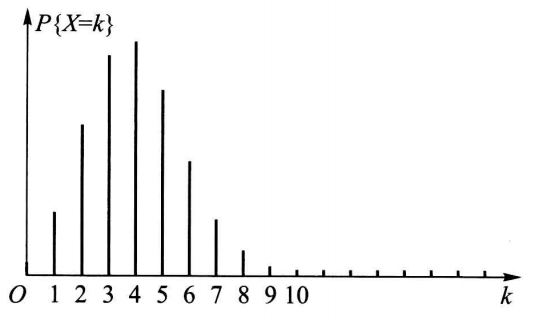
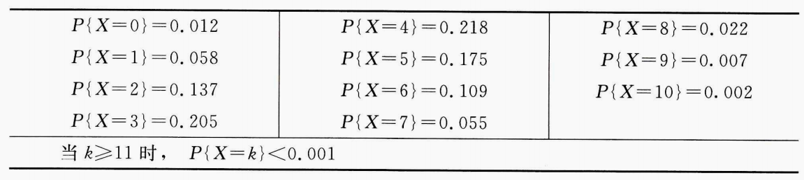

# 第二章 随机变量及其分布

## 1.随机变量
**a.介绍随机变量：**  

首先有几个概念需要区分：随机试验、随机事件和随机变量。  
> - 随机试验E：做实验，观察结果。
> 
> - 随机事件A：样本空间的**子集**。在某次试验中，如果这个子集中的元素出现，则称**事件发生**。
> 
> - 随机变量X=X(e)：定义在样本空间上的实值单值**函数**。 **函数！函数！函数！**   
> **实值**表示自变量和因变量都在实数域取值，**单值**表示对于每个自变量有唯一的因变量与之对应。

</a>

不禁要问，已经有了随机事件A了，为什么还要弄一个随机变量X呢？这不添乱么？   
引入随机变量的目的可以概括为四个字：**简化描述**。  

举例：  
掷一次骰子，观察出现的点数。我们现在想研究点数小于5的概率。  
- 如果**不借助**随机变量的话，我们就需要用一个随机事件把所有待研究的基本事件都描述清楚。比如，本例中定义事件A={1, 2, 3, 4}，然后去算P(A)。列举出基本事件是麻烦的事情，这个例子还算简单，如果遇到更复杂的研究问题，描述起来就非常麻烦。
- 如果**借助**随机变量的话，我们就可以**先用一个函数把样本空间中的每一个元素与一个实数对应起来，然后再对这个函数使用表达式进行描述(表征)，就能筛选出我们要研究的事件**。比如，本例中定义随机变量X为骰子掷出的点数，事件{X<5}就是我们要研究的事件，然后去算P{X<5}就可以了。

总之，要记着随机变量（一般用大写字母X、Y、Z、W等表示）就是一个函数，其定义域是样本空间S，值域是R的子集，对应法则需要具体分析。

下面给出随机变量的官方定义：
> 定义：
> 设随机试验的样本空间为 $S=\lbrace e \rbrace$，其中 $e$ 代表样本空间的元素。 $X=X(e)$ 是定义在样本空间 $S$ 上的实值单值函数。称 $X=X(e)$ 为随机变量。

随机变量的引入，使概率论的研究由**个别随机事件**扩大为**随机变量所表征的随机现象**的研究。今后，我们主要研究随机变量和它的分布。

**b.随机变量的分类：**  

我们根据随机变量取值的特点，随机变量分成三类：**离散型**、**连续型**和**混合型**(既有离散也有连续)。

</a>

**c.随机变量的分布函数：**   
我们在第一章说过，本门课是研究随机现象**统计规律性的**。那么怎么来研究呢？此时，数学家们就提出了一个这个分布函数，借助分布函数就能完整地描述随机变量取值的统计规律性。   

不论是离散型的或非离散型的随机变量X，都可以建立分布函数：

$$F(x)=P \lbrace   X ≤ x \rbrace, \quad-∞< x <∞ \qquad (1)$$

若已知随机变量X的分布函数，进而能知道X落在任一区间 $(x_1,x_2]$ 上的概率:

$$P \lbrace  x_1< X ≤ x_2 \rbrace =F(x_2)-F(x_1), \quad x_1 < x_2 \qquad (2)$$
这样，只要知道两个式子中的任意一个，都可以推导出另外一个，我们就能对随机变量的统计规律性有清晰的认知了。  

另外预热一下：  
- 当随机变量为离散型时，通过(2)式我们能知道随机变量X取任意可能的**值**时所对应的概率，我们称(2)式为**分布律**。
- 当随机变量为连续型时，通过(2)式我们能知道随机变量X取任意可能的**区间**时所对应的概率，我们称(2)式为**概率密度函数**(简称密度函数)。

## 2.离散型随机变量及其分布律

**离散型随机变量**：
> 定义：有些随机变量，它全部可能取到的值是**有限个**或**可列无限多个**，这种随机变量称为离散型随机变量。

举例：  
- 记随机变量X为骰子掷出来的点数，它可能取的值有6个。
- 记随机变量X为某市120急救台一昼夜收到呼唤的次数，它可能取的值可以是0, 1, 2, ...。

**离散型随机变量的分布律**：
> 定义：设离散型随机变量X所有可能取的值为 $x_k(k=1, 2, ...)$ ，X取各个可能值的概率，即事件(X=x)的概率，为
> $$P\lbrace X=x_k \rbrace =p_k, \quad k=1, 2, ...  \qquad (1)$$
> 由概率定义， $p_k$ 满足如下两个条件：  
> 条件1：
> $$p_k≥0, \quad k=1, 2, ...$$
> 条件2：
> $$\sum_{k=1}^{∞} p_k=1$$  
> 则称式(1)为离散型随机变量X的**分布律**，或者说X服从式(1)的分布。
>
> 分布律也可以用表格的形式来表示：
> 
> 
 

举例：  
设一汽车在开往目的地的道路上需经过四个信号灯，每个信号灯以1/2的概率允许或禁止汽车通过。以 $X$ 表示汽车首次停下时，它已通过的信号灯的个数 (设每个信号灯的工作是相互独立的)，求 $X$ 的分布律。  
解析：  
以 $p$ 表示每个信号灯禁止汽车通过的概率，易知 $X$ 的分布律为：

   

代入 $p=1/2$ 得：

自然界中的随机事件都服从着某个分布，科学家们对这些分布做了大量的研究，提炼出了一些常见的分布（也称为数学模型），并对这些分布的具有的性质（比如数字特征）做了详细的数学推导，得出了很多重要结论。因此，我们后人就站在巨人的肩膀上，学习一些常见的分布以及结论。

本节先介绍三种离散型随机变量的分布，分别为**零一分布**、**二项分布**和**泊松分布**。

### (一)(0-1)分布
> 定义：设随机变量X只可能取0与1两个值，它的分布律是
> 
> $$P\lbrace X=k \rbrace=p^k(1-p)^{1-k},\quad k=0,1 \quad(0 < p < 1)$$
> 
> 则称X服从以 $p$ 为参数的 **(0-1)分布**或**两点分布**或**伯努利分布**。  
> 
> (0-1)分布的分布律也可写成：

> 

简单举几个服从(0-1)分布的例子：  
- 对新生婴儿的性别进行登记。
- 检查产品的质量是否合格。
- 某车间的电力消耗是否超过负荷。
- 抛硬币试验。

### (二)伯努利实验、二项分布
**伯努利实验**：
> 定义：设试验E只有两个可能结果（$A$ 和 $\overline{A}$），则称E为**伯努利(Bernoulli)实验**。将E独立重复地进行n次，则称这一串重复的独立试验为**n重伯努利试验**。

**二项分布**：
> 定义：以 $X$ 表示n重伯努利试验中事件 $A$ 发生的次数， $p$ 表示 $A$ 发生的概率，我们称随机变量 $X$ 服从参数为  $n,p$ 的**二项分布**，记为  $X\sim b(n,p)$，它的分布律是：
> 
> $$P \lbrace X=k \rbrace=\left(\begin{array}{c}
n \\
k
\end{array}\right) p^{k}(1-p)^{n-k},k=0,1,2,\cdot \cdot \cdot ,n$$
>
> PS：当n=1时二项分布会变为(0-1)分布。

例题：按规定，某种型号电子元件的使用寿命超过1500h的为一级品。已知某一大批产品的一级品率为0.2，现在从中随机地抽查20只。问20只元件中恰有k只(k=0,1,···,20)为一级品的概率是多少？  

解析：这是不放回抽样。但由于这批元件的总数很大，且抽查的元件的数量相对于元件的总数来说又很小，因而可以当作放回抽样来处理，这样做会有一些误差，但误差不大。我们将检查一只元件看它是否为一级品看成是一次试验，检查20只元件相当于做20重伯努利试验。以 $X$ 记20只元件中一级品的只数，那么， $X$ 是一个随机变量，且有  $X\sim b(20,0.2)$ 。由二项分布的分布律计算概率为：

$$P \lbrace X=k \rbrace=\left(\begin{array}{c}
20 \\
k
\end{array}\right) 0.2^{k}0.8^{n-k},k=0,1,2,\cdot \cdot \cdot ,20$$

将计算结果列表如下：

$$\begin{array}{l}
\hline
\begin{array}{l|l|c}
P \lbrace X=0 \rbrace =0.012 & P \lbrace X=4 \rbrace =0.218 & P \lbrace X=8 \rbrace =0.022 \\
P \lbrace X=1 \rbrace =0.058 & P \lbrace X=5 \rbrace =0.175 & P \lbrace X=9 \rbrace =0.007 \\
P \lbrace X=2 \rbrace =0.137 & P \lbrace X=6 \rbrace =0.109 & P \lbrace X=10 \rbrace =0.002 \\
P \lbrace X=3 \rbrace =0.205 & P \lbrace X=7 \rbrace =0.055 & \\
\hline
\end{array}\\
\text { 当 } k \geqslant 11 \text { 时, } \quad P \lbrace X=k \rbrace <0.001\\
\hline
\end{array}$$

为了对本题的结果有一个直观了解，我们作出上表的图形：

</a>

从上图可以看到，当k增加时，概率 $P \lbrace X=k \rbrace$ 显示随之增加，直至达到最大值，随后开始减少。一般二项分布都具有这一性质。

### (三)泊松分布

在二项分布中，当 $n$ 很大， $p$ 很小，且 $np$ 等于一个常数时，会变为一个特殊的分布——**泊松分布**。此结论由泊松定理可以证明。 

**泊松定理**：
> 定义：设 $\lambda > 0$ 是常数，n是任意正整数，设 $np=\lambda$ ，则对于任一固定的非负整数 $k$ ，有：
>
> $$\lim_{n \rightarrow ∞}\left(\begin{array}{l}
n \\
k
\end{array}\right) p^{k}\left(1-p \right)^{n-k}=\frac{\lambda^{k} e^{-\lambda} }{k !}$$
>
> 此定理由法国数学家泊松提出。他发现了在伯努利试验中，当重复次数很大而概率很小的时候，**二项分布的概率值和泊松分布的概率值近似**。
>

**泊松分布**：
> 定义：设随机变量 $X$ 所有可能取的值为0, 1, 2, ... , 取各个值的概率为：
>
> $$P \lbrace X=k \rbrace = \frac{\lambda^{k} e^{-\lambda } }{k!}, \quad k=0,1,2, \cdots$$
>
> 其中 $\lambda > 0$ 是常数。则称 $X$ 服从参数为 $\lambda$ 的泊松分布，记为 $X \sim \pi(\lambda)$。
>

从泊松定理可以看出，泊松分布主要用来研究**稀有事件**。

举几个服从泊松分布的例子：  
- 一本书一页中的印刷错误数（
    > 该页中每个字都可能出错，是一个伯努利分布，一页书中一般都会有几百个字，比如n=500，比较大，而印错的概率一般是一个小概率，因此可以认为是泊松分布。
- 某地区在一天内邮递遗失的信件数。
    > 可以将一天的时间切分为很多很小的区间，在每个小区间中丢与不丢邮件是一个伯努利分布，一天中有很多个小区间，比如n=1000，而丢邮件本身也是一个概率很小的现象，因此可以认为是泊松分布。
- 某一医院在一天内的急诊病人数。
- 某一地区一个时间间隔内发生交通事故的次数。
- 在一个时间间隔内某种放射性物质发出的，经过计数器的a粒子数。

例题：  
计算机硬件公司制造某种特殊型号的微型芯片，次品率达0.1%，各例芯片成为次品相互独立。求在1000只产品中至少有2只次品的概率。以 $X$ 记产品中的次品数， $X \sim b(1 000,0.001)$ 。

解析：  
方法一（使用二项分布）：

$$\begin{aligned}
P \lbrace X \geqslant 2 \rbrace  & =1-P \lbrace X=0  \rbrace -P \lbrace X=1 \rbrace  \\
& =1-0.999^{1000}-\left(\begin{array}{c}
1000 \\
1
\end{array}\right) 0.999^{999} \times 0.001 \\
& \approx 1-0.3676954-0.3680635=0.2642411
\end{aligned}$$

</a>

方法二（使用泊松分布）：  
因为这种情况属于n很大，p很小的情况，可以使用泊松分布近似计算。
$\lambda=1000 \times 0.001=1$ 。

$$\begin{aligned}
P \lbrace X \geqslant 2 \rbrace  & =1-P \lbrace X=0  \rbrace -P \lbrace X=1 \rbrace  \\
& \approx 1-\mathrm{e}^{-1}-\mathrm{e}^{-1} \approx 0.2642411
\end{aligned}$$

</a>

显然，使用方法二计算更加方便。一般当 $n ≥ 20,p ≤ 0.05$ 时可以使用泊松分布当做二项分布的近似。

## 3.随机变量的分布函数
在第一节中，我们提到了，不论是离散型的或非离散型的随机变量X，都可以建立**分布函数**：

$$F(x)=P \lbrace   X ≤ x \rbrace, \quad-∞< x <∞ \qquad (1)$$

本节我们研究一下分布函数的性质：
> 性质1：$F(x)$ 是一个不减函数，即对于任意的 $x_1,x_2(x_1<x_2)$，有
> $$F(x_2)-F(x_1)=P \lbrace x_1 < X ≤ x_2 \rbrace ≥ 0$$
>
> 性质2：$0 ≤ F(x) ≤ 1$ ，且
> $$F(-∞)=\lim _{x \rightarrow-∞}F(x)=0,\quad F(∞)=\lim _{x \rightarrow∞}F(x)=1$$  
>
> 性质3： $F(x+0)=F(x)$，即 $F(x)$ 的右连续性。
> 

举例：  
设随机变量 $X$ 的分布律为：

$$\begin{array}{c|ccc}
X & -1 & 2 & 3 \\
\hline p_{k} & \frac{1}{4} & \frac{1}{2} & \frac{1}{4}
\end{array}$$

其分布函数为：
$$F(x)=\left\{\begin{array}{ll}
0, & x<-1, \\
\frac{1}{4}, & -1 \leqslant x<2, \\
\frac{3}{4}, & 2 \leqslant x<3, \\
1, & x \geqslant 3 .
\end{array}\right.$$

分布函数的图像为：

</a>

## 4.连续型随机变量及其概率密度

<!-- 
## 
## 5.随机变量的函数的分布
## 小结 -->
