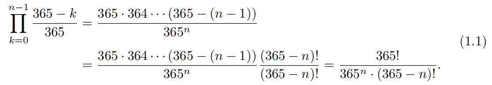
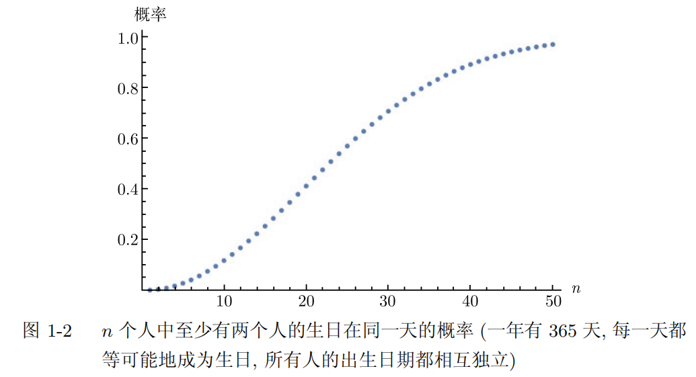

# 第1章　引言
本章概要：通过一个和学生赌博的游戏，以及几个身边发生的和概率有关且十分接地气的故事（投篮、赌博），来引起学生的兴趣。

## 1.1　生日问题
### 1.1.1　陈述问题
与微积分和线性代数不同，概率论在描述前提条件要格外清晰且小心。

> 生日问题 (表述 1)：房间里有多少人才能保证其中至少两个人的生日在同一天的概率不小于 50%？
> 
> 生日问题 (表述 2)：假设对每个人来说, 出生在一年中任何一天的概率都是相等的. 那么, 房间里有多少人才能保证其中至少两个人的生日在同一天的概率不小于 50%？
> 
> 生日问题 (表述 3)：假设客人的出生日期都是相互独立的, 并且每个人都等可能地出生在一年中的任何一天 (2 月 29 日除外), 那么房间里有多少人才能保证其中至少两个人的生日在同一天的概率不小于 50%？

如果前提条件描述不清楚，就会导致很多错误。

### 1.1.2　解决问题
作者没有一上来就哐哐地排列组合算出答案，而是介绍了他认为比较科学的思考过程，从而递进地缩小正确答案的范围，并寻找一个比较好的解决方案。  

- 第一步，通过狄利克雷鸽巢原理把答案锁定在[2,365]。  
- 第二步，假设会场已经有183个生日不相同的人了，也就是365天已经有一半被占了，当第184个人再进入的话，概率肯定高于50%，因此，答案锁定在[2,184]。
- 第三步，使用穷举法。从1个人，2个人，...，依次计算概率，能算，随着人数的增多，正面列出各种可能性很容易遗漏或重复，不高效。   
- 第四步：考虑对立事件（随着人数的增加，生日不重复的概率，当概率小于50%的时候，就停止）。
  - 第1个加入时，概率等于 $365/365=1$；  
  - 第2个加入时，概率等于 $365*364/365^2$
  - 第3个加入时，概率等于 $365*364*363/365^3$
  - ...
  - 第n个加入时，概率等于
    
</a>

 
使用计算器依次计算概率：

</a>

观察图中的点, 我们看到问题的答案是 23. 特别是当房间里有 23 个人时,“至少两个人的生日在同一天”的概率大约是 50.7%. 当房间里有30 个人时, 这个概率差不多上升到了 70.6%. 当有 40 个人时, 概率上升到了 89.1%.当有 50 个人时, 概率上升到了惊人的 97%.

在大班授课时, 教授通常会与学生赌 5 美元, 断言“教室里至少有两个人的生日在同一天”. 从上面的分析可以看出, 如果教室里的人数不少于 40, 那么教授就非常安全。

### 1.1.3　对问题和答案的推广：效率

### 1.1.4　数值检验

## 1.2　从投篮到几何级数
### 1.2.1　问题和解答
### 1.2.2　相关问题
### 1.2.3　一般问题的解决技巧

## 1.3　赌博
### 1.3.1　2008年超级碗赌注 
### 1.3.2　预期收益
### 1.3.3　对冲的价值
### 1.3.4　结论

